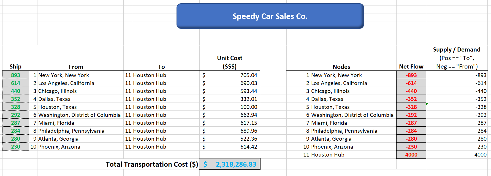
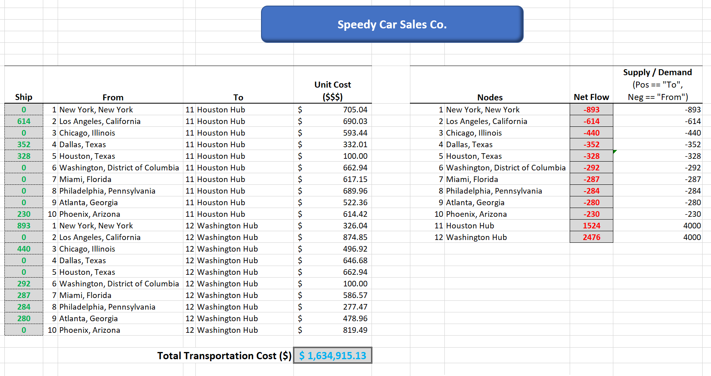
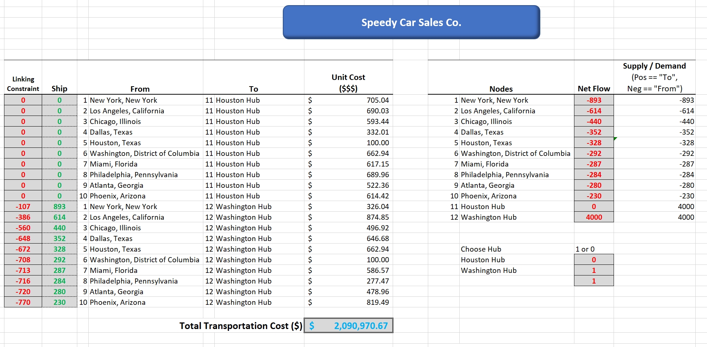

```{r setup, include=FALSE}
knitr::opts_chunk$set(echo = TRUE)
```

# Mixed-Integer Linear Programming (MILP) optimization plus sensitivity analysis

## Use of a MILP optimization method and R to choose which locations (hubs), and how many, to use as vehicle preparation and distribution centers for an online car sales company  

#### Premise of this project: Speedy Car Sales (SCS) is a fictional online automobile sales company growing its business of buying and selling used vehicles throughout the contiguous United States. Their operating model is to buy vehicles throughout the US and ship them to one or more preparation centers, prepare the vehicles, and ship them directly to the customer. SCS believes it can make up for the expense of two-way shipping cost by having fewer distribution centers which are models of efficiency. At the distribution centers, the vehicles will be inspected, cleaned, repaired, if necessary, and photographed for online sales. The vehicles will then be shipped to a buyer.

### MILP Optimization will be conducted using R and Microsoft Excel.  

### Gather and present population data  
In this fictional model, SCS will buy and sell USED vehicles throughout the U.S.  Well, where will the vehicles be coming from and going to? Where the people are! Let's get US population data by county or city.  
There are many databases and methods of showing population and/or population density. With much credit here: https://homepage.divms.uiowa.edu/~luke/classes/STAT4580/maps.html#county-population-data, we can show population data by county.  

### Display population by county  
```{r dpi = 150, warning= FALSE, message = FALSE}
if (! file.exists("PEP_2018_PEPANNRES.zip")) {
  download.file("http://www.stat.uiowa.edu/~luke/data/PEP_2018_PEPANNRES.zip",
                "PEP_2018_PEPANNRES.zip")
  unzip("PEP_2018_PEPANNRES.zip")
}

pep2018 <- read.csv("PEP_2018_PEPANNRES_with_ann.csv")
pepvars <- names(pep2018)
pep2018 <- read.csv("PEP_2018_PEPANNRES_with_ann.csv", stringsAsFactors = FALSE,
                    head = FALSE, skip = 2)
names(pep2018) <- pepvars

#head(pep2018)
#tail(pep2018)

#Working with the county names can be tricky:
  
#head(filter(pep2018, grepl(", Iowa", GEO.display.label)))

#pep2018[1803,]
#filter(pep2018, GEO.id2 == 19141)
#filter(pep2018, GEO.id2 == 22001)

# For US counties it is safer to work with the FIPS county code, which is the GEO.id2 variable.
# 
# The county.fips data frame in the maps package links the FIPS code to region names used by the map data in the maps package.
library(maps)
#head(county.fips)

# Basic Map Data
# Map data from the map function in package maps consists of the x and y coordinates of polygons and names for the regions.

usa <- map("state", fill = TRUE, plot = FALSE)
#plot(usa$x, usa$y, type = "n")
#polygon(usa$x, usa$y)

#sum(is.na(usa$x))
## [1] 62
#length(usa$names)
## [1] 63
#usa$names

library(ggplot2)
gusa <- map_data("state")
#head(gusa)
##        long      lat group order  region subregion
## 1 -87.46201 30.38968     1     1 alabama      <NA>
## 2 -87.48493 30.37249     1     2 alabama      <NA>
## 3 -87.52503 30.37249     1     3 alabama      <NA>
## 4 -87.53076 30.33239     1     4 alabama      <NA>
## 5 -87.57087 30.32665     1     5 alabama      <NA>
## 6 -87.58806 30.32665     1     6 alabama      <NA>
#head(filter(gusa, region == "virginia"))
##        long      lat group order   region  subregion
## 1 -75.64188 37.96418    53 13482 virginia chesapeake
## 2 -75.61897 37.99856    53 13483 virginia chesapeake
## 3 -75.36114 38.02721    53 13484 virginia chesapeake
## 4 -75.39552 37.99283    53 13485 virginia chesapeake
## 5 -75.41843 37.96991    53 13486 virginia chesapeake
## 6 -75.42989 37.94127    53 13487 virginia chesapeake
p <- ggplot(gusa) + geom_polygon(aes(long, lat, group = group), color = "white")
#p


# Approximate Centroids
# A quick approximation to the centroids (centers of gravity) of the polygons is to compute the center of the bounding rectangle.
# 
# This is easiest to do with the data from map_data.
library(dplyr)
state_centroids <- summarize(group_by(gusa, region),
                             x = mean(range(long)), y = mean(range(lat)))
names(state_centroids)[1] <- "state"
#head(state_centroids)

# Symbol Plots of State Population
# Aggregate the county populations to the state level:
  
state_pops <- mutate(pep2018,
                     state = tolower(sub(".*, ", "", GEO.display.label)),
                     pop = respop72018)
#unique(state_pops$state)

state_pops <- summarize(group_by(state_pops, state),
                        pop = sum(pop, na.rm = TRUE))
# Using tolower matches the case in the state_centroids table.
# 
# An alternative would be to use the state FIPS code and the state.fips table.
# 
# Merge in the centroid locations. Using inner_join drops cases not included in the lower-48 map data.

state_pops <- inner_join(state_pops, state_centroids, "state")

#head(state_pops)


# Choropleth Maps of State Population
# A choropleth map needs to have the information for coloring all the pieces of a region.
# 
# For ggplot this can be done by merging:
  
sp <- select(state_pops, region = state, pop)
gusa_pop <- left_join(gusa, sp, "region")
#head(gusa_pop)
##        long      lat group order  region subregion     pop
## 1 -87.46201 30.38968     1     1 alabama      <NA> 4887871
## 2 -87.48493 30.37249     1     2 alabama      <NA> 4887871
## 3 -87.52503 30.37249     1     3 alabama      <NA> 4887871
## 4 -87.53076 30.33239     1     4 alabama      <NA> 4887871
## 5 -87.57087 30.32665     1     5 alabama      <NA> 4887871
## 6 -87.58806 30.32665     1     6 alabama      <NA> 4887871

#A first attempt:
  
# ggplot(gusa_pop) +
#   geom_polygon(aes(long, lat, group = group, fill = pop)) +
#   coord_map("bonne", parameters=45) +
#   ggthemes::theme_map()

# This image is dominated by the fact that most state populations are small.
# 
# Showing population ranks, or percentile values, can help see the variation a bit better.
spr <- mutate(sp, rpop = rank(pop))
gusa_rpop <- left_join(gusa, spr, "region")
# ggplot(gusa_rpop) +
#   geom_polygon(aes(long, lat, group = group, fill = rpop)) +
#   coord_map("bonne", parameters=45) +
#   ggthemes::theme_map()

# Using quintile bins instead of a continuous scale:
ncls <- 6
spr <- mutate(spr,
              pcls = cut(pop, quantile(pop, seq(0, 1, len = ncls)),
                         include.lowest = TRUE))
gusa_rpop <- left_join(gusa, spr, "region")
# ggplot(gusa_rpop) +
#   geom_polygon(aes(long, lat, group = group, fill = pcls),
#                color = "grey") +
#   coord_map("bonne", parameters=45) +
#   ggthemes::theme_map() +
#   scale_fill_brewer(palette = "Reds")

#A percentile bin map using the map function requires a vector of colors for the regions:
  
usa_states <- sub(":.*", "", usa$names)
usa_pcls <- spr$pcls[match(usa_states, spr$region)]
pal <- RColorBrewer::brewer.pal(nlevels(usa_pcls), "Reds")
#map("state", fill = TRUE, col = pal[usa_pcls], border = "grey")

#This uses the match function to find indices for each polygon’s state in the regions vector.

#Another way to compute the classes for the pieces:
library(tidyr) 
usa_pieces <- data.frame(names = usa$names)
usa_pieces <- separate(usa_pieces, "names", c("region", "subregion"),
                       sep = ":", fill = "right")
usa_pieces <- left_join(usa_pieces, spr, "region")
#map("state", fill = TRUE, col = pal[usa_pieces$pcls], border = "grey")


# Choropleth Maps of County Population
# For a county-level ggplot map, first get the polygon data frame:
library(purrr)
library(tidyr)
library(ggplot2)
gcounty <- map_data("county")
#head(gcounty)

#To attach the FIPS code we first need to clean up the county.fips table a bit:
  
#head(filter(county.fips, grepl(":", polyname)))

#Remove the sub-county regions, remove duplicate rows, and split the polyname variable into region and subregion:
  
fipstab <-
  transmute(county.fips, fips, county = sub(":.*", "", polyname))
fipstab <- unique(fipstab)
fipstab <-
  separate(fipstab, county, c("region", "subregion"), sep = ",")
#head(fipstab)

#Now use left_join to merge the FIPS code into gcounty:
  
gcounty <- left_join(gcounty, fipstab, c("region", "subregion"))
#head(gcounty)


#Pull together the data for the map:
ncls <- 6 
cpop <- select(pep2018,
               fips = GEO.id2,
               pop10 = rescen42010,
               pop18 = respop72018)
cpop <- mutate(cpop, rpop18 = rank(pop18))
cpop <- mutate(cpop,
               pcls18 = cut(pop18, quantile(pop18, seq(0, 1, len = ncls)),
                            include.lowest = TRUE))
#head(cpop)

#Some of the counties in the polygon data base may not appear in the population data:
  
#unique(select(filter(gcounty, ! fips %in% cpop$fips), region, subregion))
##         region subregion
## 1 south dakota   shannon
#unique(select(anti_join(gcounty, cpop, "fips"), region, subregion))
##         region subregion
## 1 south dakota   shannon
#A left_join with cpop will give these NA values.

gcounty_pop <- left_join(gcounty, cpop, "fips")
#unique(select(filter(gcounty_pop, is.na(rpop18)), region, subregion))
##         region subregion
## 1 south dakota   shannon
#County level population plots using the default continuous scale:

# ggplot(gcounty_pop) +
#   geom_polygon(aes(long, lat, group = group, fill = rpop18),
#                color = "grey", size = 0.1) +
#   geom_polygon(aes(long, lat, group = group),
#                fill = NA, data = gusa, color = "lightgrey") +
#   coord_map("bonne", parameters=45) + ggthemes::theme_map()


#A discrete scale with a very different color to highlight the counties with missing information:
ggplot(gcounty_pop) +
  geom_polygon(aes(long, lat, group = group, fill = pcls18),
               color = "grey", size = 0.1) +
  geom_polygon(aes(long, lat, group = group),
               fill = NA, data = gusa, color = "lightgrey") +
  coord_map("bonne", parameters=45) + ggthemes::theme_map() +
  scale_fill_brewer(palette = "Reds", na.value = "white") +
  theme(legend.position="none") +
  labs(title = "U.S. Population by County", 
       subtitle = "Light to Dark == Lower to Higher Population")

```
This is a pleasant looking map, but doesn't help us too much for out purposes. This data was separated in to 5 different levels of population by county.  It gives us false impressions of high population areas. For instance, look at Arizona and Texas.  Because the counties are so big in Arizona, it looks like the entire state is deep red and has a lot higher population than it actually does whereas Texas looks moderately populated.  The same with Wyoming, which gives the appearance of being heavily populated. Also, while one can get the geographic coordinates of the center of a county, that doesn't mean that most of the population is at the center of a county. At geographic location is necessary for getting distances between cities.  

Fortunately, the Internet can link us up with U.S. Census data to get estimated population by city and also by metro area.  

### Display population data by city  
  
After some access to databases and some data manipulation, we can display some city data.  

```{r dpi = 150, warning= FALSE, message = FALSE}
# us map of states and populations
library(tidyverse)
library(ggplot2)
# "us.cities" in maps package contains This database is of us cities of population
# greater than about 40,000. Also included are state capitals of any 
# population size.
# "state" database produces a map of the states of the United States
# mainland generated from US De- partment of the Census data
library(maps)
library(scales)

us_states <- as_tibble(map_data("state"))
us_cities <- as_tibble(us.cities)

us_cities <-us_cities %>% 
  filter(country.etc != "AK") %>% 
  filter(country.etc != "HI")

ggplot(data = us_states, mapping = aes(x = long, y = lat,
                                       group = group)) +
  geom_polygon(fill= "white", color = "black") +
  geom_point(data = us_cities, aes( x = long, y = lat,
                                    size = pop, color = "red", alpha = 0.5),
             inherit.aes = FALSE) +
  guides(alpha = FALSE) +
  guides(color = FALSE) +
  scale_size("Population", labels = comma) +
  ggthemes::theme_map() +
  theme(legend.position="bottom") +
  labs(title = "U.S. Population By City", 
       subtitle = "For All U.S. Cities With Greater Than 40,000 People") +
  coord_map("bonne", parameters=45)
```


The plot above gives us a better representation of population centers. Arizona now shows only a few population centers around Phoenix and Tucson. The heavily populated areas of Los Angeles/San Diego, San Francisco/Oakland, Chicago, Boston, New York, Washington D.C., Miami, etc... are clearly shown better. And look at Wyoming. Only two cities show up in this data.  

In the above, AK and HI are removed. There are 1,001 cities in this data base with populations greater than 40,000. Optimization of this many sites might doable for advanced commercial optimization algorithms, but it is far too many for what we want to do and certainly too many for the Solver that comes with MS Excel.  

### Modeling the Speedy Car Sales business    
For this fictional sales company, it is in the early growth stage. 

At this stage, we will assume they have just one hub and are looking to expand. The car company started in Houston, TX and that is where their distribution center is. 

For this next phase however, we won't use individual cities. Each new hub costs a lot in new capital. Using city data might skew our results towards states with very large cities compared to a larger amount of smaller cities pack together in metro areas. If we chose the top 25 or so cities, quite a few California cities might make the cut and might leave out a city such as Washington D.C. But U.S. Census data is available for metro areas.

After some more data wrangling, we chose the top 45 areas plus a few extras, like Spokane, WA. The first six (out of 50) of our data set looks like this below:
```{r warning= FALSE, message = FALSE}
#### import data set ####
library(readr)
library(tidyr)
# Read in .csv file and create Tibble DF.
cities_raw <- read_csv("my_top_50.csv")
head(cities_raw)
```

### Display top 50 metro areas

```{r warning= FALSE, message = FALSE}
#### now map it ####
library(tidyverse)
library(ggplot2)
# "us.cities" in maps package contains This database is of us cities of population
# greater than about 40,000. Also included are state capitals of any 
# population size.
# "state" database produces a map of the states of the United States
# mainland generated from US De- partment of the Census data
library(maps)
library(scales)

# Read in 10 city data with distances made in "Get Distances"
cities_50 <- read_csv("distances_my_top_50.csv")

# Get states for plotting state map
us_states <- as_tibble(map_data("state"))


ggplot(data = us_states, mapping = aes(x = long, y = lat,
                                       group = group)) +
  geom_polygon(fill= "white", color = "black") +
  geom_point(data = cities_50, aes( x = lon.from, y = lat.from,
                                    size = from_population, color = "purple", alpha = 0.5),
             inherit.aes = FALSE) +
  geom_text(data = cities_50, aes(x = lon.from, y = lat.from, label = from.short), size = 3, inherit.aes = FALSE) +
  guides(alpha = FALSE) +
  guides(color = FALSE) +
  scale_size("Population", labels = comma) +
  #scale_color_gradient2(midpoint=6500000,
  #                    low="blue", high="red" ) +
  
  #coord_map("bonne", parameters=45) + 
  ggthemes::theme_map() +
  theme(legend.position="bottom") +
  labs(title = "U.S. Population By Metro Area", 
       subtitle = "Using U.S. Census Definition of Metro Area")+
  coord_map("bonne", parameters=45) 

```


Now we have metro area and state. Each metro area has been named by it's prominent city. For example, the New York metro area consists of New York, NY, Newark, NJ, and the surrounding small cities. It is lableled just "New York". This will allow us to calculate distances very easily via Google's API serice which uses Lat/Long or City/State. We are using City/State here.

In our fictional company, they are currently buying and selling 4,000 car per month. Why 4,000? Thanks for asking! The company did $1.2B in sales in 2019. With an average selling price of 
$30,000 per vehicle, that is 40,000 vehicles a year and 3,333 a month.  Let's assume they are growing. That is how we get 4,000 cars a month.

We are going to start with a small problem and work towards bigger problems. We will start with the 10 largest metro areas.

For this optimization, we have 10 cities and 1 hub (Houston, TX). As mentioned earlier, the amount of buying and selling is related to the population. We model sales locations simply by the ratio of populations. If New York metro area is 19,000,000 and Los Angeles metro area is 9,500,000, NY will have twice the sales of LA.

From our 50, we filter to the largest 10. Then we get the ratio of each city to the 10-city total and multiple by 4,000.
Here is our result:
```{r warning= FALSE, message = FALSE}
cities_10 <- read_csv("distances_top_10.csv")
cities_10 %>% 
  select(from, to, from_num_cars) %>% 
  filter(to == "Houston, Texas" )
```


```{r warning= FALSE, message = FALSE}
#### now map it ####
library(tidyverse)


# "us.cities" in maps package contains This database is of us cities of population
# greater than about 40,000. Also included are state capitals of any 
# population size.
# "state" database produces a map of the states of the United States
# mainland generated from US De- partment of the Census data
library(maps)
library(ggmap)

# Read in 10 city data with distances made in "Get Distances"
cities_10 <- read_csv("distances_top_10.csv")

# Get states for plotting state map
us_states <- as_tibble(map_data("state"))


ggplot(data = us_states, mapping = aes(x = long, y = lat,
                                       group = group)) +
  geom_polygon(fill= "white", color = "black") +
  geom_point(data = cities_10, aes( x = lon.from, y = lat.from,
                                    size = from_population, color = "purple", alpha = 0.5),
             inherit.aes = FALSE) +
  #geom_text(data = cities_10, aes(x = lon.from, y = lat.from, label = from), inherit.aes = FALSE) +
  geom_text(data = cities_10, aes(x = lon.from, y = lat.from, label = from.short), size = 3, inherit.aes = FALSE) +
  guides(alpha = FALSE) +
  guides(color = FALSE) +
  scale_size("Population", labels = comma) +
  #scale_color_gradient2(midpoint=6500000,
  #                    low="blue", high="red" ) +
  
  #coord_map("bonne", parameters=45) + 
  ggthemes::theme_map() +

  theme(legend.position="bottom") +
  labs(title = "10 Large Metro Areas in the U.S.")+
  coord_map("bonne", parameters=45)


```

### Get the cost of shipping  
For our optimization, well, we need something to be optimized. We are going to optimize shipping costs. Specifically, we will minimize costs.  
We figured that shipping costs might come in two sub-costs. 1) labor to load and unload and 2) cost by mile to ship. Looking through some shipping websites, it is quickly discovered that costs decrease for longer shipping distances. After some trial and error, we came up with the following heuristic shipping cost function:  
Shipping Cost (in dollars) = 100 (flat rate to load and unload) + 100 *sqrt(distance)  
$$
Cost(Dollars) = 100 + 100\sqrt{miles}
$$
It looks like this:  

```{r warning= FALSE, message = FALSE}
m <- matrix(0, ncol = 2, nrow = 4000)
dist <- data.frame(m)
x <- c("Distance", "Cost")
colnames(dist) <- x
dist$Distance <- c(seq(1, 4000))
dist$Cost <- sapply(dist$Distance, function(x) 100 + 15*sqrt(x))
#head(dist)
plot(dist$Distance,dist$Cost, xlab = "Distance (miles)", ylab = "Cost ($)",
     title("Shipping Cost Function"))  

```
  
### Optimize shipping costs between 10 cities and Houston  
Now we are getting close to modeling something. For our first optimization, we will optimize the number of vehicles to ship from each of the 10 cities to the 1 hub, Houston. This, of course, is a trivial problem. But let's work it anyway.  

The optimization problem looks like this:
$$min\sum_{i=1}^{10} C_iX_i$$
$$st: X_i \ge S_i~~~\forall i,~i=1~to~10$$
$$X_i \ge 0~~~\forall i,~i=1~to~10$$

$$X \in Integers$$
~where $C$ is the cost from each city to Houston, where $X$ is the calculated number of vehicles to move from each city to Houston, and where $S$ is the number of vehicles shipped from each city to Houston.  

### Calculate shipping costs  
We have identified the shipping cost function, but we didn't actually calculate shipping costs yet.  
We need the distances between each city and a potential hub. For this trivial problem, we could probably just go to Google Maps or some similar website and find 9 distances from each city to Houston (distance to Houston from Houston = 0. :) But the cost isn't $0 in our model. There is a cost for loading and unloading at least.  
For this problem, we will consider the shipping distance from in and around Houston to our hub in Houstan as 0 even though it wouldn't actually be that. But the minimum $100 should cover that.  
Getting the distance from Google Maps for driving from New York to Houston and entering that data took about 20 seconds. Doing that 10 times isn't a big deal. But we need the distances between 50 cities.  That's 49 + 48 + 47 + 46... well, you get the idea.
**Fortunately, there is an easier way: Google API https://cloud.google.com/maps-platform/**There are a number of others, such as Microsoft. We used Google. Our database actually needed the distance between each city and every other, including itself, both ways. We could have calculated one way and manipulated the database and also entered 0's for each distance between a city and itself, but **a simple loop and a connection to Google API data made this easy. 2,500 data calls took about 2 minutes. By "hand" would have taken 6-7 hours possibly.**    
Now we have the distance between each city and Houston (and every other data pair) and the cost function. We easily calculate the cost between each city.  

#### Optimization in Excel  
MS Excel has a limited Solver included with the regular version of Excel. Next is a screenshot of this problem solved using the Excel optimization function.  

 

Excel has solved this trivial problem at a cost of $2,318,286.98. You can see cost to ship between the From and To cities as "Unit Cost". Supply/Demand has the number of vehicles that need to be shipped. "Ship" has the solved solution for this trivial problem.  

#### Optimization in R  
Below are the raw results from this problem solved via MILP optimization in R.  
The first box shows that the solver found an optimal solution and what it is.  
The second box are more formal results.  
The third box shows the number of cars shipped between each city.  

```{r warning= FALSE, message = FALSE}
library(tidyverse)
library(ompr)
library(magrittr)
library(ROI)
library(ROI.plugin.glpk)
library(ompr)
library(ompr.roi)
# Shipping Cost
cost <- c(705.04,690.03,593.44,332.01,100.00,662.94,617.15,689.96,522.36,614.42)
# Supply to move from each cities
supply <- c(893,614,440,352,328,292,287,284,280,230)

model <- MIPModel()  %>% 
  # Number of cars shiped from Xi to Xj
  add_variable(x[i], i = 1:10, type = "integer", lb = 0) %>% 
  # minimize shipping cost
  set_objective(sum_expr(cost[i] * x[i], i = 1:10), "min") %>% 
  # must use supply from each city
  add_constraint(x[i] >= supply[i], i = 1:10) #%>% 
  # use only one Y
  #add_constraint(sum_expr(y[j], j = 1:2) == 1) %>% 
  # add linking variables
  
#result <- ROI_solve(model, solver = "glpk")
# result <- solve_model(model, with_ROI(solver = "glpk", verbose = TRUE))
# result
# get_solution(result, x[i])


result <- solve_model(model, with_ROI(solver = "glpk", verbose = TRUE))
result
#get_solution(result, x[i])
cities_10 <- read_csv("distances_top_10.csv")
solution <- as_tibble(get_solution(result, x[i]))
solution$FROM_city <- c(cities_10$from[1:10])
solution$TO_city <- "Houston, Texas"
names(solution)[3] <- "# Cars Shipped"
solution
```


```{r warning= FALSE, message = FALSE}
library(ggmap)
ggplot(data = us_states, mapping = aes(x = long, y = lat,
                                       group = group)) +
  geom_polygon(fill= "white", color = "black") +
  geom_point(data = cities_10, aes( x = lon.from, y = lat.from,
                                    size = from_population, color = "purple", alpha = 0.5),
             inherit.aes = FALSE) +
  geom_text(data = cities_10, aes(x = lon.from, y = lat.from, label = from.short), size = 3, inherit.aes = FALSE) +
  theme(legend.position="bottom") +
  geom_segment(data = cities_10, aes(x = lon.from, y = lat.from, xend = lon.to[5],
                                        yend = lat.to[5]), color = "blue", size = 0.3,
               arrow = arrow(), inherit.aes = FALSE) +
  guides(alpha = FALSE) +
  guides(color = FALSE) +
  scale_size("Population", labels = comma) +
  #scale_color_gradient2(midpoint=6500000,
  #                    low="blue", high="red" ) +
  
  #coord_map("bonne", parameters=45) + 
  ggthemes::theme_map() +
  labs(title = "Visual of Solution Showing Arrows Indicating Shipping") +
  coord_map("bonne", parameters=45)


```

### Optimization between 10 cities and 2 hubs
Here is our first true optimization problem. We have 10 metro areas, the cost to ship between each and Houston or Washington and the number of cars to be shipped. Here we will let the solver chose where each city will ship that give us the least expensive solution. The optimization write-up looks like this:
$$min\sum_{i=1}^{10} \sum_{j=1}^{2}C_{i,j}X_{i,j}$$
$$st: \sum_{j=1}^{2}X_{i,j} \ge S_i~~~\forall i=1~to~10$$
$$X_{i,j} \ge 0~~~\forall i,~i=1~to~10,~~~\forall j,~j=1~to~2$$

$$X \in Integers$$
~where $C$ is the cost from each city to each hub, where $X$ is the calculated number of vehicles to move from each city to each hub, and where $S$ is the number of vehicles shipped from each city to Houston and Washington.  

#### Solution in Excel  


Excel has solved this problem at a cost of $1,634,915.13. You can see cost to ship between the From and To cities as "Unit Cost". Supply/Demand has the number of vehicles that need to be shipped. "Ship" has the solved solution.  You can see now that there is a choice between two hubs by looking in the Ship column. You can see some numbers going to Houston and some to Washington.  
  
#### Solution in R  

The first box below shows the optimal solution as cost in dollars to ship each month.  
The second box shows the raw result for each city to hub pair. Right now, there are only 20 options. Row 2 has X, i=2, j=1, value = 614. This means 614 cars shipped from Los Angeles metro area (i=2) to Houston (j=1). This will get overwhelmning with larger problems so this format won't be shown again.  
The third box is the shipping solution cleaned up a bit.  
```{r warning= FALSE, message = FALSE}
library(tidyverse)
library(scales)
library(ompr)
library(magrittr)
library(ROI)
library(ROI.plugin.glpk)
library(ompr)
library(ompr.roi)
# Shipping Cost
cost <- c(705.04,690.03,593.44,332.01,100.00,662.94,617.15,689.96,522.36,614.42,
          326.04,874.85,496.92,646.68,662.94,100.00,586.57,277.47,478.96,819.49)
cost_m <- matrix(cost, nrow = 10, byrow = FALSE)
#cost_m
# Supply to move from each cities
supply <- c(893,614,440,352,328,292,287,284,280,230)

model <- MIPModel()  %>% 
  # Number of cars shiped from Xi to Xj
  add_variable(x[i,j], i = 1:10, j = 1:2, type = "integer", lb = 0) %>% 
  # minimize shipping cost
  set_objective(sum_expr(cost_m[i,j] * x[i,j], i = 1:10, j = 1:2), "min") %>% 
  # must use supply from each city
  
  
  ### fix this with J's, not 1 and 2
  #add_constraint(x[i, 1] + x[i, 2] >= supply[i], i = 1:10) #%>%
  # FIXED! works with j's
  add_constraint(sum_expr(x[i, j], j = 1:2) >= supply[i], i = 1:10) #%>% 
# use only one Y
#add_constraint(sum_expr(y[j], j = 1:2) == 1) %>% 
# add linking variables

#result <- ROI_solve(model, solver = "glpk")
result <- solve_model(model, with_ROI(solver = "glpk", verbose = FALSE))
result
get_solution(result, x[i,j])
temp_df <- as_tibble(get_solution(result, x[i,j]))
#temp_df
### This works!!


#result <- ROI_solve(model, solver = "glpk")
#result <- solve_model(model, with_ROI(solver = "glpk", verbose = TRUE))
#result
#get_solution(result, x[i])
cities_10 <- read_csv("distances_top_10.csv")
solution <- as_tibble(get_solution(result, x[i,j]))
library(dplyr)
#solution
# Adds after the second column
solution <- solution %>%
  add_column(FROM_city = 0) %>% 
  add_column(TO_city = 0) %>% 
  add_column(lon.to = 0) %>%
  add_column(lat.to = 0) %>%
  add_column(lon.from = 0) %>%
  add_column(lat.from = 0)
from.column <- c(cities_10$to[1:10])
to.column <- c("Houston, Texas", "Washington, District of Columbia")
m <- 1
n <- 0
for (k in 1:2){
  for (l in 1:10){
    solution$FROM_city[m] <- from.column[l]
    solution$lon.from[m] <- cities_10$lon.to[l]
    solution$lat.from[m] <- cities_10$lat.to[l]
    solution$TO_city[m] <- to.column[k]
    solution$lon.to[m] <- cities_10$lon.to[5 + n]
    solution$lat.to[m] <- cities_10$lat.to[5 + n]
    m <- m + 1
  }
  n <- n + 1
}

solution <- solution %>% 
  filter(value > 0)
### This works!!!
# no clean it up
solution_display <- solution %>% 
  filter(value > 0) %>% 
  select(variable, i, j, value, FROM_city, TO_city)
solution_display

#### now map it ####
library(tidyverse)


# "us.cities" in maps package contains This database is of us cities of population
# greater than about 40,000. Also included are state capitals of any 
# population size.
# "state" database produces a map of the states of the United States
# mainland generated from US De- partment of the Census data
library(maps)

# Read in 10 city data with distances made in "Get Distances"
cities_10 <- read_csv("distances_top_10.csv")

# Get states for plotting state map
us_states <- as_tibble(map_data("state"))


ggplot(data = us_states, mapping = aes(x = long, y = lat,
                                       group = group)) +
  geom_polygon(fill= "white", color = "black") +
  geom_point(data = cities_10, aes( x = lon.from, y = lat.from,
                                    size = from_population, color = "purple", alpha = 0.5),
             inherit.aes = FALSE) +
  geom_text(data = cities_10, aes(x = lon.from, y = lat.from, label = from.short), size = 3, inherit.aes = FALSE) +
  theme(legend.position="bottom") +
  geom_segment(data = solution, aes(x = lon.from, y = lat.from, xend = lon.to,
                                     yend = lat.to), color = "blue", size = 0.3,
               arrow = arrow(), inherit.aes = FALSE) +
  guides(alpha = FALSE) +
  guides(color = FALSE) +
  scale_size("Population", labels = comma) +
  #scale_color_gradient2(midpoint=6500000,
  #                    low="blue", high="red" ) +
  
  #coord_map("bonne", parameters=45) + 
  ggthemes::theme_map() +

  labs(title = "Visual Solution for 10 Cities and 2 Hubs")+
  coord_map("bonne", parameters=45)

```
  
In case you were wondering, the distance from Miami to Washington D.C. is 1,058 miles and the distance from Miami to Houston is 1,188 miles. The projection type of this display creates an optical illusion that Miami is closer to Houston than Washington D.C.  


### Optimization between 10 cities and 2 hubs (but must choose one or the other, i.e. only one hub will be chosen and used)

Next we are going to still use Houston and Washington as our two hub options, but we will make the solver choose ONLY one of the two. The optimization problem looks like this:
$$min\sum_{i=1}^{10} \sum_{j=1}^{2}C_{i,j}X_{i,j}$$
$$st: \sum_{j=1}^{2}X_{i,j} \ge S_i~~~\forall i=1~to~10$$
$$ \sum_{j=1}^{2}Y_j=1$$
$$X_{i,j} \le MAX(S)*Y_j,~~~\forall i,~i=1~to~10,~~~\forall j,~j=1~to~2$$
$$X_{i,j} \ge 0~~~\forall i,~i=1~to~10,~~~\forall j,~j=1~to~2$$

$$X \in Integers$$
$$ Y \in 0~or~1$$
~where $C$ is the cost from each city to each hub, where $X$ is the calculated number of vehicles to move from each city to each hub, & where $S$ is the number of vehicles shipped from each city to Houston.  
These two constraints are added: $\sum_{j=1}^{2}Y_j=1$ and $X_{i,j} \le MAX(S)*Y_j$ and are very important to link the new variable $Y$, which is a binary, to the shipping variable $X$.  


#### Solution in Excel  

  

Above you can see that all of the cities shipped all of their cars to the Washington, D.C. hub. They ALL had to choose to the same hub. If they had chosen Houston, that would have meant that it would have cost more to ship there than DC. But they chose DC, which means that this solution must have been cheaper than Houston. And it was: $2,090,971 for shipping all to Washington, vs. 
$2,318,287 for shipping all to Houston.  

#### Solution in R  
The first box has the minimum cost solution.  
The second box shows the Y variable solution, i.e. which hub was chosen.  
The third box shows the X variable solution and number of cars shipped between which cities and which hubs. In this case, as we forced the solver to choose only one hub, Washington was chosen.  


```{r warning= FALSE, message = FALSE}
library(ompr)
library(magrittr)
library(ROI)
library(ROI.plugin.glpk)
library(ompr)
library(ompr.roi)
# Shipping Cost
cost <- c(705.04,690.03,593.44,332.01,100.00,662.94,617.15,689.96,522.36,614.42,
          326.04,874.85,496.92,646.68,662.94,100.00,586.57,277.47,478.96,819.49)
cost_m <- matrix(cost, nrow = 10, byrow = FALSE)
#cost_m
# Supply to move from each cities
supply <- c(893,614,440,352,328,292,287,284,280,230)

model <- MIPModel()  %>% 
  # Number of cars shiped from Xi to Xj
  add_variable(x[i,j], i = 1:10, j = 1:2, type = "integer", lb = 0) %>% 
  # Choose Houston (Y1) or Washington (Y2)
  add_variable(y[j], j = 1:2, type = "binary") %>% 
  #add_variable(y[j], j = 1:2, type = "integer", lb = 0, ub = 1)
  # minimize shipping cost
  set_objective(sum_expr(cost_m[i,j] * x[i,j], i = 1:10, j = 1:2), "min") %>% 
  # must use supply from each city
 
  ### fix this with J's, not 1 and 2
  #add_constraint(x[i, 1] + x[i, 2] >= supply[i], i = 1:10) #%>%
  # FIXED! works with j's
  add_constraint(sum_expr(x[i, j], j = 1:2) >= supply[i], i = 1:10) %>% 
  # use only one Y
  add_constraint(sum_expr(y[j], j = 1:2) == 1) %>% 
  # add linking variables
  add_constraint(x[i,j] <= 1000*y[j], i = 1:10, j = 1:2)
  # add_constraint(x[i,1] <= 1000*y[1], i = 1:10) %>% 
  # add_constraint(x[i,2] <= 1000*y[2], i = 1:10)

#result <- ROI_solve(model, solver = "glpk")
result <- solve_model(model, with_ROI(solver = "glpk", verbose = FALSE))
result
#get_solution(result, x[i,j])
#get_solution(result, y[j])


cities_10 <- read_csv("distances_top_10.csv")
solution <- as_tibble(get_solution(result, x[i,j]))
#solution

library(dplyr)
# get hub solution
solution_hub <- as_tibble(get_solution(result, y[j]))
to.column <- c("Houston, Texas", "Washington, District of Columbia")
solution_hub <- solution_hub %>% 
  add_column(Hub = 0)
solution_hub$Hub <- to.column
solution_hub

# Adds after the second column
solution <- solution %>%
  add_column(FROM_city = 0) %>% 
  add_column(TO_city = 0) %>% 
  add_column(lon.to = 0) %>%
  add_column(lat.to = 0) %>%
  add_column(lon.from = 0) %>%
  add_column(lat.from = 0)
from.column <- c(cities_10$to[1:10])
to.column <- c("Houston, Texas", "Washington, District of Columbia")
m <- 1
n <- 0
for (k in 1:2){
  for (l in 1:10){
    solution$FROM_city[m] <- from.column[l]
    solution$lon.from[m] <- cities_10$lon.to[l]
    solution$lat.from[m] <- cities_10$lat.to[l]
    solution$TO_city[m] <- to.column[k]
    solution$lon.to[m] <- cities_10$lon.to[5 + n]
    solution$lat.to[m] <- cities_10$lat.to[5 + n]
    m <- m + 1
  }
  n <- n + 1
}
solution <- solution %>% 
  filter(value > 0)
### This works!!!
# no clean it up
solution_display <- solution %>% 
  filter(value > 0) %>% 
  select(variable, i, j, value, FROM_city, TO_city)
solution_display


#### now map it ####
library(tidyverse)


# "us.cities" in maps package contains This database is of us cities of population
# greater than about 40,000. Also included are state capitals of any 
# population size.
# "state" database produces a map of the states of the United States
# mainland generated from US De- partment of the Census data
library(maps)

# Read in 10 city data with distances made in "Get Distances"
cities_10 <- read_csv("distances_top_10.csv")

# Get states for plotting state map
us_states <- as_tibble(map_data("state"))


ggplot(data = us_states, mapping = aes(x = long, y = lat,
                                       group = group)) +
  geom_polygon(fill= "white", color = "black") +
  geom_point(data = cities_10, aes( x = lon.from, y = lat.from,
                                    size = from_population, color = "purple", alpha = 0.5),
             inherit.aes = FALSE) +
  geom_text(data = cities_10, aes(x = lon.from, y = lat.from, label = from.short), size = 3, inherit.aes = FALSE) +
  theme(legend.position="bottom") +
  geom_segment(data = solution, aes(x = lon.from, y = lat.from, xend = lon.to,
                                    yend = lat.to), color = "blue", size = 0.3,
               arrow = arrow(), inherit.aes = FALSE) +
  guides(alpha = FALSE) +
  guides(color = FALSE) +
  scale_size("Population", labels = comma) +
  #scale_color_gradient2(midpoint=6500000,
  #                    low="blue", high="red" ) +
  
  #coord_map("bonne", parameters=45) + 
  ggthemes::theme_map() +

  labs(title = "Visual Solution for 10 Cities and a Choice Between 2 Hubs: Houston and Washington")


```


### 10 Cities, Choose Up To 10 Hubs  
Now we have our basic ideas down, we can scale up. We can set up to choose the number of hubs between 1 and 10 and then solve.

The optimization problem looks like this:
$$min\sum_{i=1}^{10} \sum_{j=1}^{10}C_{i,j}X_{i,j}$$
$$st: \sum_{j=1}^{10}X_{i,j} \ge S_i~~~\forall i=1~to~10$$
$$ \sum_{j=1}^{10}Y_j=NumHubs$$
$$X_{i,j} \le MAX(S)*Y_j,~~~\forall i,~i=1~to~10,~~~\forall j,~j=1~to~10$$
$$X_{i,j} \ge 0~~~\forall i,~i=1~to~10,~~~\forall j,~j=1~to~10$$

$$X \in Integers$$
$$ Y \in 0~or~1$$
~where $C$ is the cost from each city to each hub, where $X$ is the calculated number of vehicles to move from each city to each hub, where $Y$ is which hubs were chosen in the solution, and where $S$ is the number of vehicles shipped from each city to Houston.  


#### Solution in Excel  

As you can see, Excel can't do this. We have quickly reached the limit of what the internal Solver than came with Excel can do. There are commercial add-ins to Excel that can be purchased that will allow bigger optimization problems. **But we can keep going with R.**


### 10 Cities, Choose 3 Hubs  
Here we will keep using the same 10 large metro areas and choose the number of hubs we want to use. The number of hubs can be from 1 to 10. We randomly chose 3.  
#### Solution in R  

The first box below has the "hubs" solution: New York, Los Angeles, and Dallas were chosen. The second box shows the number of cars shipped.  


```{r warning= FALSE, message = FALSE}
# Choose more than two, any two

#### import data set ####
library(readr)
library(tidyr)
library(dplyr)
# Read in .csv file and create Tibble DF.
cities_raw <- read_csv("distances_my_top_50.csv")
# Turn into a dataframe
city_data <- as_tibble(cities_raw)
get_supply <- as_tibble(cities_raw)
# Add a number for each city 1 to 50
city_data <- city_data %>% 
  add_column(num.from = 0, .after = 4) %>% 
  add_column(num.to = 0, .after = 6)
  
# number from and to numbers
xx <- 1
for (ii in 1:50){
  for (jj in 1:50) {
    city_data$num.from[xx] <- ii
    city_data$num.to[xx] <- jj
    xx <- xx + 1
  }
}


# Choose number of cities to use
num_cities <- 10

#data <- as.data.frame(Network_Modeling)
# Get top six in each set of TO and FROM
# city_data <- city_data %>% 
#   group_by(num.from) %>%
#   slice_min(order_by = num.from, n = num_cities) %>%
#   group_by(num.to) %>%
#   slice_min(order_by = num.to, n = num_cities) %>%
#   arrange(num.from)

city_data <- city_data %>% 
  group_by(num.from) %>%
  slice_head(n = num_cities) %>% 
  group_by(num.to) %>% 
  slice_head(n = num_cities) %>% 
  group_by(num.from)
  

# redo number of cars from each city
# get supply
num_cars_month <- 4000
#library(dplyr)
get_supply <- get_supply %>% 
  slice_head(n = num_cities) %>% 
  #arrange(desc(Population)) %>% # sort Tibble by Population and descending
  #slice_head(n = 11) %>% # Get only the first n rows.
  mutate(to_pop_ratio = to_population / sum(to_population)) %>% # percent of Population
  mutate(to_num_cars = round(to_pop_ratio * num_cars_month,0)) # Calc number cars moving each month

# make into a cost matrix
cost <- city_data$cost
cost_6_city <- matrix(cost, nrow = num_cities, byrow = FALSE)


library(ompr)
library(magrittr)
library(ROI)
library(ROI.plugin.glpk)
library(ompr)
library(ompr.roi)
# Shipping Cost
# cost <- c(705.04,690.03,593.44,332.01,100.00,662.94,617.15,689.96,522.36,614.42,
#           326.04,874.85,496.92,646.68,662.94,100.00,586.57,277.47,478.96,819.49)
# cost_m <- matrix(cost, nrow = 10, byrow = FALSE)
# cost_m
# Supply to move from each cities
#supply <- as.vector(city_data$`Number of cars Shipped From`[1:6])
# the above wasn't resized for 6 cities
supply <- as.vector(get_supply$to_num_cars)

# model <- MIPModel()  %>% 
#   # Number of cars shiped from Xi to Xj
#   add_variable(x[i,j], i = 1:6, j = 1:6, type = "integer", lb = 0) %>% 
#   # Choose Houston (Y1) or Washington (Y2)
#   add_variable(y[j], j = 1:6, type = "binary") %>% 
#   #add_variable(y[j], j = 1:2, type = "integer", lb = 0, ub = 1)
#   # minimize shipping cost
#   set_objective(sum_expr(cost_6_city[i,j] * x[i,j], i = 1:6, j = 1:6), "min") %>% 
#   # must use supply from each city
#   
#   ### fix this with J's, not 1 and 2
#   #add_constraint(x[i, 1] + x[i, 2] >= supply[i], i = 1:10) #%>%
#   # FIXED! works with j's
#   add_constraint(sum_expr(x[i, j], j = 1:6) >= supply[i], i = 1:6) %>% 
#   # add this to keep Houston
#   add_constraint(y[5] == 1) %>% 
#   add_constraint(sum_expr(y[j], j = 1:6) == 2) %>% 
#   # add linking variables
#   # 1500 because the new limit should be 1224
#   add_constraint(x[i,j] <= 1500*y[j], i = 1:6, j = 1:6)
# 
# 
# #result <- ROI_solve(model, solver = "glpk")
# result <- solve_model(model, with_ROI(solver = "glpk", verbose = TRUE))
# result
# get_solution(result, x[i,j])
# get_solution(result, y[j])


num_hubs <- 3

model <- MIPModel()  %>% 
  # Number of cars shiped from Xi to Xj
  add_variable(x[i,j], i = 1:length(supply), j = 1:length(supply), type = "integer", lb = 0) %>% 
  # Choose Houston (Y1) or Washington (Y2)
  add_variable(y[j], j = 1:length(supply), type = "binary") %>% 
  #add_variable(y[j], j = 1:2, type = "integer", lb = 0, ub = 1)
  # minimize shipping cost
  set_objective(sum_expr(cost_6_city[i,j] * x[i,j], i = 1:length(supply), j = 1:length(supply)), "min") %>% 
  # must use supply from each city
  
  ### fix this with J's, not 1 and 2
  #add_constraint(x[i, 1] + x[i, 2] >= supply[i], i = 1:10) #%>%
  # FIXED! works with j's
  add_constraint(sum_expr(x[i, j], j = 1:length(supply)) >= supply[i], i = 1:length(supply)) %>% 
  # add this to keep Houston
  #add_constraint(y[5] == 1) %>% 
  add_constraint(sum_expr(y[j], j = 1:length(supply)) == num_hubs) %>% 
  # add linking variables
  # 1500 because the new limit should be 1224
  add_constraint(x[i,j] <= max(supply)*y[j], i = 1:length(supply), j = 1:length(supply))


#result <- ROI_solve(model, solver = "glpk")
result <- solve_model(model, with_ROI(solver = "glpk", verbose = FALSE))
result
#get_solution(result, x[i,j])
#get_solution(result, y[j])


#cities_10 <- read_csv("distances_top_10.csv")
solution <- as_tibble(get_solution(result, x[i,j]))
#solution

library(dplyr)
# get hub solution
solution_hub <- as_tibble(get_solution(result, y[j]))
to.column <- as.vector(get_supply$to)
solution_hub <- solution_hub %>% 
  add_column(Hub = 0)
solution_hub$Hub <- to.column
solution_hub

# Adds after the second column
solution <- solution %>%
  add_column(FROM_city = 0) %>% 
  add_column(TO_city = 0) %>% 
  add_column(lon.to = 0) %>%
  add_column(lat.to = 0) %>%
  add_column(lon.from = 0) %>%
  add_column(lat.from = 0)

#m <- 1
for ( k in 1:length(city_data$lon.to)){
  solution$FROM_city[k] <- city_data$from[k]
  solution$lon.from[k] <- city_data$lon.from[k]
  solution$lat.from[k] <- city_data$lat.from[k]
  solution$TO_city[k] <- city_data$to[k]
  solution$lon.to[k] <- city_data$lon.to[k]
  solution$lat.to[k] <- city_data$lat.to[k]
  #m < m + 1

}
#solution
# from.column <- c(cities_10$to[1:10])
# to.column <- c("Houston, Texas", "Washington, District of Columbia")
# m <- 1
# n <- 0
# for (k in 1:2){
#   for (l in 1:10){
#     solution$FROM_city[m] <- from.column[l]
#     solution$lon.from[m] <- cities_10$lon.to[l]
#     solution$lat.from[m] <- cities_10$lat.to[l]
#     solution$TO_city[m] <- to.column[k]
#     solution$lon.to[m] <- cities_10$lon.to[5 + n]
#     solution$lat.to[m] <- cities_10$lat.to[5 + n]
#     m <- m + 1
#   }
#   n <- n + 1
# }

### This works!!!
# no clean it up
# solution <- solution %>% 
#   filter(value > 0)
solution <- solution %>% 
  filter(value > 0)
#solution
### This works!!!
# no clean it up
solution_display <- solution %>% 
  filter(value > 0) %>% 
  select(variable, i, j, value, FROM_city, TO_city)
solution_display


#### now map it ####
library(tidyverse)


# "us.cities" in maps package contains This database is of us cities of population
# greater than about 40,000. Also included are state capitals of any 
# population size.
# "state" database produces a map of the states of the United States
# mainland generated from US De- partment of the Census data
library(maps)

# Read in 10 city data with distances made in "Get Distances"
cities_10 <- read_csv("distances_top_10.csv")

# Get states for plotting state map
us_states <- as_tibble(map_data("state"))


ggplot(data = us_states, mapping = aes(x = long, y = lat,
                                       group = group)) +
  geom_polygon(fill= "white", color = "black") +
  geom_point(data = city_data, aes( x = lon.from, y = lat.from,
                                    size = from_population, color = "purple", alpha = 0.5),
             inherit.aes = FALSE) +
  geom_text(data = city_data, aes(x = lon.from, y = lat.from, label = from), inherit.aes = FALSE) +
  geom_segment(data = solution, aes(x = lon.from, y = lat.from, xend = lon.to,
                                    yend = lat.to), color = "blue", size = 0.3,
               arrow = arrow(), inherit.aes = FALSE) +
  guides(alpha = FALSE) +
  guides(color = FALSE) +
  scale_size("Population", labels = comma) +
  #scale_color_gradient2(midpoint=6500000,
  #                    low="blue", high="red" ) +
  
  #coord_map("bonne", parameters=45) + 
  ggthemes::theme_map() +

  labs(title = "Visual Solution for 10 Cities and 3 Hubs")+
  coord_map("bonne", parameters=45)

```


## 50 Cities, Chose 2 Hubs (1 Must Be Houston)  
We are now using all of the 50 large metros areas we found earlier. We will model our growing car sales company. If their first hub was in Houston (and they don't want to move it at this time), where should the next hub be located.  
#### Solution in R  


```{r warning= FALSE, message = FALSE}
# Choose more than two, any two

#### import data set ####
library(scales)
library(tidyverse)
library(readr)
library(tidyr)
library(dplyr)
# Read in .csv file and create Tibble DF.
cities_raw <- read_csv("distances_my_top_50.csv")
# Turn into a dataframe
city_data <- as_tibble(cities_raw)
get_supply <- as_tibble(cities_raw)
# Add a number for each city 1 to 50
city_data <- city_data %>% 
  add_column(num.from = 0, .after = 4) %>% 
  add_column(num.to = 0, .after = 6)
  
# number from and to numbers
xx <- 1
for (ii in 1:50){
  for (jj in 1:50) {
    city_data$num.from[xx] <- ii
    city_data$num.to[xx] <- jj
    xx <- xx + 1
  }
}


# Choose number of cities to use
num_cities <- 50

#data <- as.data.frame(Network_Modeling)
# Get top six in each set of TO and FROM
# city_data <- city_data %>% 
#   group_by(num.from) %>%
#   slice_min(order_by = num.from, n = num_cities) %>%
#   group_by(num.to) %>%
#   slice_min(order_by = num.to, n = num_cities) %>%
#   arrange(num.from)

city_data <- city_data %>% 
  group_by(num.from) %>%
  slice_head(n = num_cities) %>% 
  group_by(num.to) %>% 
  slice_head(n = num_cities) %>% 
  group_by(num.from)
  

# redo number of cars from each city
# get supply
num_cars_month <- 4000
#library(dplyr)
get_supply <- get_supply %>% 
  slice_head(n = num_cities) %>% 
  #arrange(desc(Population)) %>% # sort Tibble by Population and descending
  #slice_head(n = 11) %>% # Get only the first n rows.
  mutate(to_pop_ratio = to_population / sum(to_population)) %>% # percent of Population
  mutate(to_num_cars = round(to_pop_ratio * num_cars_month,0)) # Calc number cars moving each month

# make into a cost matrix
cost <- city_data$cost
cost_6_city <- matrix(cost, nrow = num_cities, byrow = FALSE)


library(ompr)
library(magrittr)
library(ROI)
library(ROI.plugin.glpk)
library(ompr)
library(ompr.roi)
# Shipping Cost
# cost <- c(705.04,690.03,593.44,332.01,100.00,662.94,617.15,689.96,522.36,614.42,
#           326.04,874.85,496.92,646.68,662.94,100.00,586.57,277.47,478.96,819.49)
# cost_m <- matrix(cost, nrow = 10, byrow = FALSE)
# cost_m
# Supply to move from each cities
#supply <- as.vector(city_data$`Number of cars Shipped From`[1:6])
# the above wasn't resized for 6 cities
supply <- as.vector(get_supply$to_num_cars)

# model <- MIPModel()  %>% 
#   # Number of cars shiped from Xi to Xj
#   add_variable(x[i,j], i = 1:6, j = 1:6, type = "integer", lb = 0) %>% 
#   # Choose Houston (Y1) or Washington (Y2)
#   add_variable(y[j], j = 1:6, type = "binary") %>% 
#   #add_variable(y[j], j = 1:2, type = "integer", lb = 0, ub = 1)
#   # minimize shipping cost
#   set_objective(sum_expr(cost_6_city[i,j] * x[i,j], i = 1:6, j = 1:6), "min") %>% 
#   # must use supply from each city
#   
#   ### fix this with J's, not 1 and 2
#   #add_constraint(x[i, 1] + x[i, 2] >= supply[i], i = 1:10) #%>%
#   # FIXED! works with j's
#   add_constraint(sum_expr(x[i, j], j = 1:6) >= supply[i], i = 1:6) %>% 
#   # add this to keep Houston
#   add_constraint(y[5] == 1) %>% 
#   add_constraint(sum_expr(y[j], j = 1:6) == 2) %>% 
#   # add linking variables
#   # 1500 because the new limit should be 1224
#   add_constraint(x[i,j] <= 1500*y[j], i = 1:6, j = 1:6)
# 
# 
# #result <- ROI_solve(model, solver = "glpk")
# result <- solve_model(model, with_ROI(solver = "glpk", verbose = TRUE))
# result
# get_solution(result, x[i,j])
# get_solution(result, y[j])


num_hubs <- 2

model <- MIPModel()  %>% 
  # Number of cars shiped from Xi to Xj
  add_variable(x[i,j], i = 1:length(supply), j = 1:length(supply), type = "integer", lb = 0) %>% 
  # Choose Houston (Y1) or Washington (Y2)
  add_variable(y[j], j = 1:length(supply), type = "binary") %>% 
  #add_variable(y[j], j = 1:2, type = "integer", lb = 0, ub = 1)
  # minimize shipping cost
  set_objective(sum_expr(cost_6_city[i,j] * x[i,j], i = 1:length(supply), j = 1:length(supply)), "min") %>% 
  # must use supply from each city
  
  ### fix this with J's, not 1 and 2
  #add_constraint(x[i, 1] + x[i, 2] >= supply[i], i = 1:10) #%>%
  # FIXED! works with j's
  add_constraint(sum_expr(x[i, j], j = 1:length(supply)) >= supply[i], i = 1:length(supply)) %>% 
  # add this to keep Houston
  add_constraint(y[5] == 1) %>% 
  add_constraint(sum_expr(y[j], j = 1:length(supply)) == num_hubs) %>% 
  # add linking variables
  # 1500 because the new limit should be 1224
  add_constraint(x[i,j] <= max(supply)*y[j], i = 1:length(supply), j = 1:length(supply))


#result <- ROI_solve(model, solver = "glpk")
result <- solve_model(model, with_ROI(solver = "glpk", verbose = FALSE))
result
#get_solution(result, x[i,j])
#get_solution(result, y[j])


#cities_10 <- read_csv("distances_top_10.csv")
solution <- as_tibble(get_solution(result, x[i,j]))
#solution

library(dplyr)
# get hub solution
solution_hub <- as_tibble(get_solution(result, y[j]))
to.column <- as.vector(get_supply$to)
solution_hub <- solution_hub %>% 
  add_column(Hub = 0)
solution_hub$Hub <- to.column
solution_hub <- solution_hub %>% 
  filter(value > 0)
solution_hub

# Adds after the second column
solution <- solution %>%
  add_column(FROM_city = 0) %>% 
  add_column(TO_city = 0) %>% 
  add_column(lon.to = 0) %>%
  add_column(lat.to = 0) %>%
  add_column(lon.from = 0) %>%
  add_column(lat.from = 0)

#m <- 1
for ( k in 1:length(city_data$lon.to)){
  solution$FROM_city[k] <- city_data$from[k]
  solution$lon.from[k] <- city_data$lon.from[k]
  solution$lat.from[k] <- city_data$lat.from[k]
  solution$TO_city[k] <- city_data$to[k]
  solution$lon.to[k] <- city_data$lon.to[k]
  solution$lat.to[k] <- city_data$lat.to[k]
  #m < m + 1

}
#solution
# from.column <- c(cities_10$to[1:10])
# to.column <- c("Houston, Texas", "Washington, District of Columbia")
# m <- 1
# n <- 0
# for (k in 1:2){
#   for (l in 1:10){
#     solution$FROM_city[m] <- from.column[l]
#     solution$lon.from[m] <- cities_10$lon.to[l]
#     solution$lat.from[m] <- cities_10$lat.to[l]
#     solution$TO_city[m] <- to.column[k]
#     solution$lon.to[m] <- cities_10$lon.to[5 + n]
#     solution$lat.to[m] <- cities_10$lat.to[5 + n]
#     m <- m + 1
#   }
#   n <- n + 1
# }

### This works!!!
# no clean it up
solution <- solution %>% 
  filter(value > 0)

solution_display <- solution %>%
  filter(value > 0) %>%
  select(variable, i, j, value, FROM_city, TO_city)
solution_display

#### now map it ####
library(tidyverse)


# "us.cities" in maps package contains This database is of us cities of population
# greater than about 40,000. Also included are state capitals of any 
# population size.
# "state" database produces a map of the states of the United States
# mainland generated from US De- partment of the Census data
library(maps)

# Read in 10 city data with distances made in "Get Distances"
cities_10 <- read_csv("distances_top_10.csv")

# Get states for plotting state map
us_states <- as_tibble(map_data("state"))


ggplot(data = us_states, mapping = aes(x = long, y = lat,
                                       group = group)) +
  geom_polygon(fill= "white", color = "black") +
  geom_point(data = city_data, aes( x = lon.from, y = lat.from,
                                    size = from_population, color = "purple", alpha = 0.5),
             inherit.aes = FALSE) +
  geom_text(data = city_data, aes(x = lon.from, y = lat.from, label = from), inherit.aes = FALSE) +
  geom_segment(data = solution, aes(x = lon.from, y = lat.from, xend = lon.to,
                                    yend = lat.to), color = "blue", size = 0.3,
               arrow = arrow(), inherit.aes = FALSE) +
  guides(alpha = FALSE) +
  guides(color = FALSE) +
  scale_size("Population", labels = comma) +
  #scale_color_gradient2(midpoint=6500000,
  #                    low="blue", high="red" ) +

  #coord_map("bonne", parameters=45) +
  ggthemes::theme_map() +

  labs(title = "Visual Solution for 50 Cities and 3 Hubs")+
  coord_map("bonne", parameters=45)

```


### Let's 50 C, best 3 hubs, any hubs  

#### Solution in R  


```{r warning= FALSE, message = FALSE}
# Choose more than two, any two

#### import data set ####
library(readr)
library(tidyr)
library(dplyr)
# Read in .csv file and create Tibble DF.
cities_raw <- read_csv("distances_my_top_50.csv")
# Turn into a dataframe
city_data <- as_tibble(cities_raw)
get_supply <- as_tibble(cities_raw)
# Add a number for each city 1 to 50
city_data <- city_data %>% 
  add_column(num.from = 0, .after = 4) %>% 
  add_column(num.to = 0, .after = 6)
  
# number from and to numbers
xx <- 1
for (ii in 1:50){
  for (jj in 1:50) {
    city_data$num.from[xx] <- ii
    city_data$num.to[xx] <- jj
    xx <- xx + 1
  }
}


# Choose number of cities to use
num_cities <- 50

#data <- as.data.frame(Network_Modeling)
# Get top six in each set of TO and FROM
# city_data <- city_data %>% 
#   group_by(num.from) %>%
#   slice_min(order_by = num.from, n = num_cities) %>%
#   group_by(num.to) %>%
#   slice_min(order_by = num.to, n = num_cities) %>%
#   arrange(num.from)

city_data <- city_data %>% 
  group_by(num.from) %>%
  slice_head(n = num_cities) %>% 
  group_by(num.to) %>% 
  slice_head(n = num_cities) %>% 
  group_by(num.from)
  

# redo number of cars from each city
# get supply
num_cars_month <- 4000
#library(dplyr)
get_supply <- get_supply %>% 
  slice_head(n = num_cities) %>% 
  #arrange(desc(Population)) %>% # sort Tibble by Population and descending
  #slice_head(n = 11) %>% # Get only the first n rows.
  mutate(to_pop_ratio = to_population / sum(to_population)) %>% # percent of Population
  mutate(to_num_cars = round(to_pop_ratio * num_cars_month,0)) # Calc number cars moving each month

# make into a cost matrix
cost <- city_data$cost
cost_6_city <- matrix(cost, nrow = num_cities, byrow = FALSE)


library(ompr)
library(magrittr)
library(ROI)
library(ROI.plugin.glpk)
library(ompr)
library(ompr.roi)
# Shipping Cost
# cost <- c(705.04,690.03,593.44,332.01,100.00,662.94,617.15,689.96,522.36,614.42,
#           326.04,874.85,496.92,646.68,662.94,100.00,586.57,277.47,478.96,819.49)
# cost_m <- matrix(cost, nrow = 10, byrow = FALSE)
# cost_m
# Supply to move from each cities
#supply <- as.vector(city_data$`Number of cars Shipped From`[1:6])
# the above wasn't resized for 6 cities
supply <- as.vector(get_supply$to_num_cars)

# model <- MIPModel()  %>% 
#   # Number of cars shiped from Xi to Xj
#   add_variable(x[i,j], i = 1:6, j = 1:6, type = "integer", lb = 0) %>% 
#   # Choose Houston (Y1) or Washington (Y2)
#   add_variable(y[j], j = 1:6, type = "binary") %>% 
#   #add_variable(y[j], j = 1:2, type = "integer", lb = 0, ub = 1)
#   # minimize shipping cost
#   set_objective(sum_expr(cost_6_city[i,j] * x[i,j], i = 1:6, j = 1:6), "min") %>% 
#   # must use supply from each city
#   
#   ### fix this with J's, not 1 and 2
#   #add_constraint(x[i, 1] + x[i, 2] >= supply[i], i = 1:10) #%>%
#   # FIXED! works with j's
#   add_constraint(sum_expr(x[i, j], j = 1:6) >= supply[i], i = 1:6) %>% 
#   # add this to keep Houston
#   add_constraint(y[5] == 1) %>% 
#   add_constraint(sum_expr(y[j], j = 1:6) == 2) %>% 
#   # add linking variables
#   # 1500 because the new limit should be 1224
#   add_constraint(x[i,j] <= 1500*y[j], i = 1:6, j = 1:6)
# 
# 
# #result <- ROI_solve(model, solver = "glpk")
# result <- solve_model(model, with_ROI(solver = "glpk", verbose = TRUE))
# result
# get_solution(result, x[i,j])
# get_solution(result, y[j])


num_hubs <- 3

model <- MIPModel()  %>% 
  # Number of cars shiped from Xi to Xj
  add_variable(x[i,j], i = 1:length(supply), j = 1:length(supply), type = "integer", lb = 0) %>% 
  # Choose Houston (Y1) or Washington (Y2)
  add_variable(y[j], j = 1:length(supply), type = "binary") %>% 
  #add_variable(y[j], j = 1:2, type = "integer", lb = 0, ub = 1)
  # minimize shipping cost
  set_objective(sum_expr(cost_6_city[i,j] * x[i,j], i = 1:length(supply), j = 1:length(supply)), "min") %>% 
  # must use supply from each city
  
  ### fix this with J's, not 1 and 2
  #add_constraint(x[i, 1] + x[i, 2] >= supply[i], i = 1:10) #%>%
  # FIXED! works with j's
  add_constraint(sum_expr(x[i, j], j = 1:length(supply)) >= supply[i], i = 1:length(supply)) %>% 
  # add this to keep Houston
  #add_constraint(y[5] == 1) %>% 
  add_constraint(sum_expr(y[j], j = 1:length(supply)) == num_hubs) %>% 
  # add linking variables
  # 1500 because the new limit should be 1224
  add_constraint(x[i,j] <= max(supply)*y[j], i = 1:length(supply), j = 1:length(supply))


#result <- ROI_solve(model, solver = "glpk")
result <- solve_model(model, with_ROI(solver = "glpk", verbose = FALSE))
result
#get_solution(result, x[i,j])
#get_solution(result, y[j])


#cities_10 <- read_csv("distances_top_10.csv")
solution <- as_tibble(get_solution(result, x[i,j]))
#solution

library(dplyr)
# get hub solution
solution_hub <- as_tibble(get_solution(result, y[j]))
to.column <- as.vector(get_supply$to)
solution_hub <- solution_hub %>% 
  add_column(Hub = 0)
solution_hub$Hub <- to.column 
solution_hub <- solution_hub %>% 
  filter(value > 0)
solution_hub

# Adds after the second column
solution <- solution %>%
  add_column(FROM_city = 0) %>% 
  add_column(TO_city = 0) %>% 
  add_column(lon.to = 0) %>%
  add_column(lat.to = 0) %>%
  add_column(lon.from = 0) %>%
  add_column(lat.from = 0)

#m <- 1
for ( k in 1:length(city_data$lon.to)){
  solution$FROM_city[k] <- city_data$from[k]
  solution$lon.from[k] <- city_data$lon.from[k]
  solution$lat.from[k] <- city_data$lat.from[k]
  solution$TO_city[k] <- city_data$to[k]
  solution$lon.to[k] <- city_data$lon.to[k]
  solution$lat.to[k] <- city_data$lat.to[k]
  #m < m + 1

}
#solution
# from.column <- c(cities_10$to[1:10])
# to.column <- c("Houston, Texas", "Washington, District of Columbia")
# m <- 1
# n <- 0
# for (k in 1:2){
#   for (l in 1:10){
#     solution$FROM_city[m] <- from.column[l]
#     solution$lon.from[m] <- cities_10$lon.to[l]
#     solution$lat.from[m] <- cities_10$lat.to[l]
#     solution$TO_city[m] <- to.column[k]
#     solution$lon.to[m] <- cities_10$lon.to[5 + n]
#     solution$lat.to[m] <- cities_10$lat.to[5 + n]
#     m <- m + 1
#   }
#   n <- n + 1
# }

### This works!!!
# no clean it up
solution <- solution %>%
  filter(value > 0)
#solution
### This works!!!
# no clean it up
solution_display <- solution %>%
  filter(value > 0) %>%
  select(variable, i, j, value, FROM_city, TO_city)
solution_display

#### now map it ####
library(tidyverse)


# "us.cities" in maps package contains This database is of us cities of population
# greater than about 40,000. Also included are state capitals of any 
# population size.
# "state" database produces a map of the states of the United States
# mainland generated from US De- partment of the Census data
library(maps)

# Read in 10 city data with distances made in "Get Distances"
cities_10 <- read_csv("distances_top_10.csv")

# Get states for plotting state map
us_states <- as_tibble(map_data("state"))


ggplot(data = us_states, mapping = aes(x = long, y = lat,
                                       group = group)) +
  geom_polygon(fill= "white", color = "black") +
  geom_point(data = city_data, aes( x = lon.from, y = lat.from,
                                    size = from_population, color = "purple", alpha = 0.5),
             inherit.aes = FALSE) +
  geom_text(data = city_data, aes(x = lon.from, y = lat.from, label = from.short), size = 3, inherit.aes = FALSE) +
  geom_segment(data = solution, aes(x = lon.from, y = lat.from, xend = lon.to,
                                    yend = lat.to), color = "blue", size = 0.3,
               arrow = arrow(), inherit.aes = FALSE) +
  guides(alpha = FALSE) +
  guides(color = FALSE) +
  scale_size("Population", labels = comma) +
  #scale_color_gradient2(midpoint=6500000,
  #                    low="blue", high="red" ) +

  #coord_map("bonne", parameters=45) +
  ggthemes::theme_map() +

  labs(title = "Visual Solution for 50 Cities and 3 Hubs")+
  coord_map("bonne", parameters=45)

```


# Sensitivity Analysis  
  
Some possible questions we'd like to answer:  

What if we change cost to ship, will that change which hubs are chosen?  
What if we add a cost function for the actual hub? How will that affect the outcome?  

Two additional shipping cost functions were tried as shown below:  
$$Cost(Dollars) = 150 + 150\sqrt{miles}$$  
$$Cost(Dollars) = 50 + 50\sqrt{miles}$$  
There will be referred to as: "High" and "Low".  And the original "Med" shown below:
$$Cost(Dollars) = 100 + 100\sqrt{miles}$$  

For a hub rental function, the following might be needed:  
Mechanical inspection: each bay could do 2 cars a day (round up) (at least 20'x30')  
Clean and prep: each bay could do 2 cars a day (round up) (at least 15'x30')  
Heavy mechanical repair[only 10% of cars]: each bay could do 0.5 cars a day (round up) (at least 20'x30')  
Photo booth: each bay could do 4 cars a day (round up) (at least 20'x30')  
Foreman offices: 30' by 30'
20 workdays a month

$$B = 20*30*\frac{N_{cars}}{2} + 15*30*\frac{N_{cars}}{2} + 20*30*2*\frac{N_{cars}}{10} + 20*30*\frac{N_{cars}}{4} + 30*30$$
~ where $B$ = sqft of building needed, $N_{cars}$ = number of cars per month/20, [rounded up to next whole number for each work case].  
A quick search for leasing auto mechanical space in Maryland yielded rates between 75cents/sqft to $3/sqft. We'll used three levels:
High: $3 per sqft
Med: $1.75 per sqft
Low: $0.75 per sqft  
For each of these spaces, they were rounded up to the nearest whole number. So, if a hub should have 1.23 mechanics' bays, the result will be that it needs 2 mechanic bays. Same for the other positions.  

A similar method was used to for the laborers. And a rate adjustment was used which is another heuristic. For the rate $R$ used, level adjustments are: High - $1.25*R$, Medium - $1*R$, and Low - $0.5*R$.  

## Calculations  
450 calculations were planned. For a dataset with 50 metro areas, an optimization would be done for each solution of the number of hubs from 1 to 50. Then, for each solution, the 3 different shipping costs. And, for those, the 3 different Rent/Labor rates.  
That's 50 * 3 * 3 = 450  

## Houston, we have a problem...  
As it turns out, the 2015 Macbook used wasn't fully up to the task. Significant more time was needed to solve problems with 50 metro areas and up to 50 hubs. 1 hub solved in about 1 minute. 2 hubs needed about 10 minutes. 3 hubs - 35 minutes. 4 hubs - well over an hour. For 5 hubs, the solver appeared to be about 40% complete at 3 hours and the calculation was stopped. It just wasn't reasonable to keep going.  
Fortunately, 25 metros and up to 25 hubs was significantly quicker. The total time for these smaller optimizations was just over two hours.  
A plot of the outcomes is below.  

#### Plot output

```{r warning= FALSE, message = FALSE}
final2 <- read_csv("25_city_results_to_plot.csv")
library(scales)
ggplot(data = final2, mapping = aes(x = num.hubs, y = total.cost)) +
  geom_point(data = final2, aes(x = num.hubs, y = total.cost, shape=miles.func, color = rent.func)) +
  labs(title = "Total Cost (per month)",
      subtitle = "Shipping and Preparing Cars for Speedy Car Sales, Inc.", 
       x = "Number of Hubs", y = "Total Cost ($)", shape = "Shipping Cost", 
      color = "Rent & Labor Cost") +
  theme(legend.position="bottom") +
  scale_y_continuous(label=dollar_format())
```
  
#### Analysis  
The shape of the "Rent & Labor Cost" curves for each H, M, & L level are all very similar. In other words, for the three different Shipping Costs for Low Rent * Labor Cost, the curvew are very similar. This indicates Shipping Costs (at least how estimated in this model) have less impact on the optimal number of hubs than Rent & Labor Costs do. Excluding Rent & Labor Costs all together (not shown here) shows that Costs keep decreasing as more hubs are added. But, of course, hubs cost money to operate.  
  

The amount of Rent & Labor Costs to operate each hub clearly matter in this model. As modeled, one can clearly a minimum cost near 9 hubs for H and M costs (as modeled). This is because as more and more hubs are added and fewer and fewer cars go to each hub, there is the expectation that some of the mechanics and vehicle preparers won't be fully employed 8 hours a day. But, the company still needs to have them.  
  
As shipping costs appear to matter less than rent and labor costs, it might be beneficial to next look at finding locations where the rent and labor rates are lowest. Would an area in middle Pennsylvania be a better location due to reduced hub expenses than placing a hub in New York, Philadelphia, Baltimore, or Washington D.C. even though there might be a slight increase in shipping costs. Probably so.  

#### Notes:  
- Shipping calculations used were just one model quickly developed using a little bit of time on a website and adding heuristics. The modifier for H, M, & L was just a rule of thumb. Follow-on modeling would be necessary to get more accurate shipping calculations.  
- Rent/labor calculations/modeling were also developed using heuristics. The modifier for H, M, & L was also a rule of thumb based on judgment, not detailed research and analysis. Detailed city-by-city analysis might be necessary to get an accurate model for rent/labor.  
- Shipping costs assumed this effort was contracted out.  Other modeling could be done to compare contracting vs. in-house shipping ability. Or if some mix between contracting/in-house would be the best option.  


#### Follow-on ideas:
1) Add in long haul freight that might be less expensive, such as shipping part way via rail. This might only be available in certain very large metro areas.
2) Webscrape, or develop another model, to get more accurate shipping costs.  
3) Get more accurate rent and labor costs.  
4) Include up from capital outlays in the costs for a certain period of time, such as 5 years.  
5) Include the rent/labor of a metro area in the optimization function. This is much more complex but could perhaps result in different outcomes. For example, if Philadelphia is much less expensive than New York, Philadelphia might be a hub chosen over New York.  
6) Link up with a much more powerful computer to do bigger and bigger datasets to get more and more fidelity. Online cloud computing would be the next step. 
7) Include growth projections in modeling.  
8) Include sensitivity analysis of the growth projections.  


