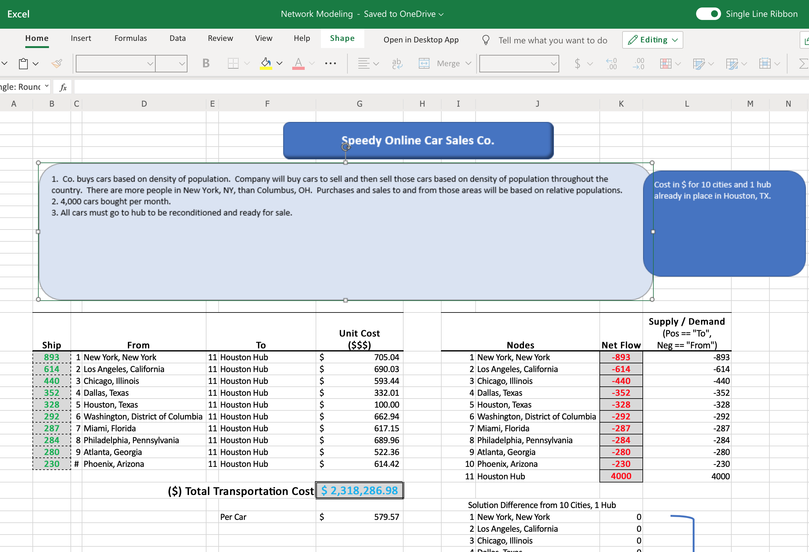
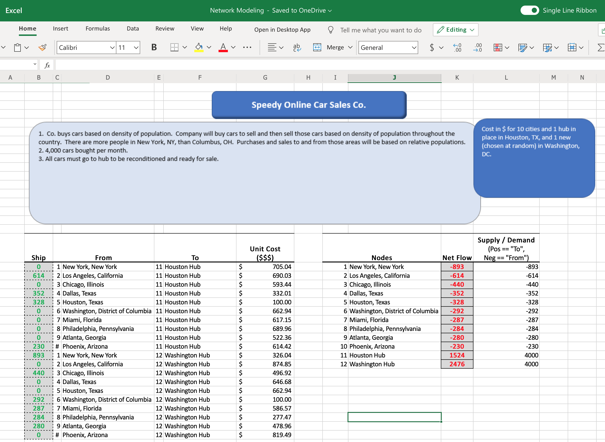
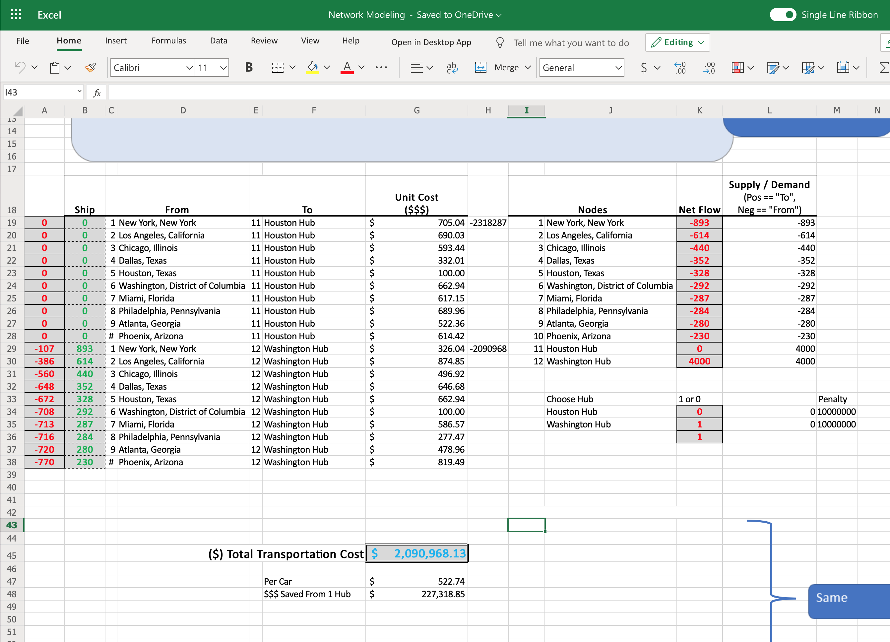
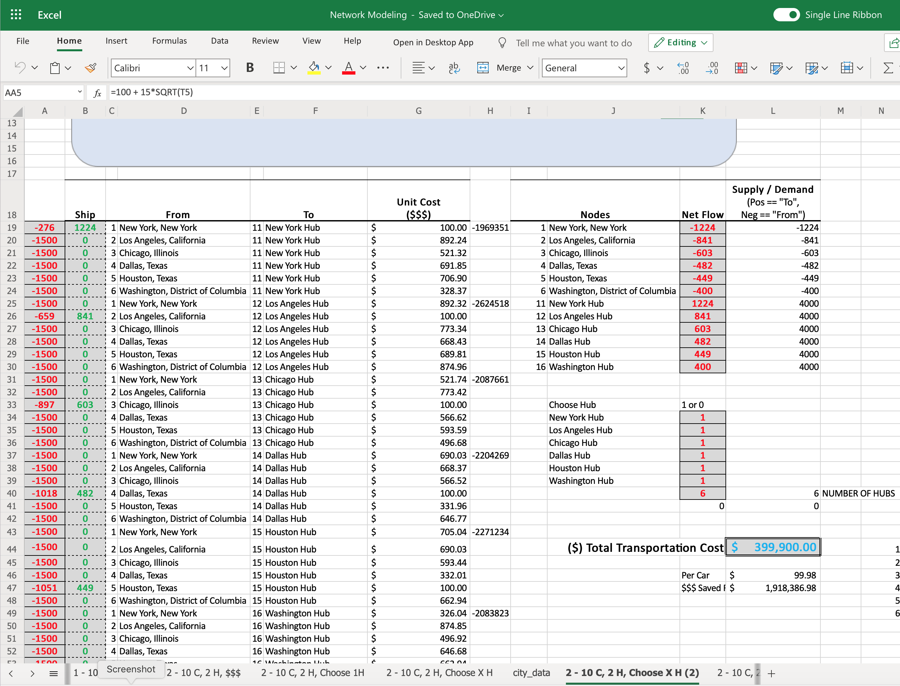

```{r setup, include=FALSE}
knitr::opts_chunk$set(echo = TRUE)
```

# Mixed-Integer Linear Programming (MILP) optimization plus sensitivity analysis

## Use of a MILP optimization method and R to choose which locations (hubs), and how many to use as vehicle preparation and distribution centers for an online car sales company  

#### Premise of this project: Speedy Car Sales (SCS) is a fictional online automobile sales company growing its business of buying and selling used vehicles throughout the contiguous United States. Their operating model is to buy vehicles throughout the US and ship them to one or more preparation centers, prepare the vehicles, and ship them directly to the customer. SCS believes it can make up for the expense of two-way shipping cost by having fewer distribution centers which are models of efficiency. At the distribution centers, the vehicles will be inspected, cleaned, repaired, if necessary, and photographed for online sales. The vehicles will then be shipped to a buyer.

### MILP Optimization will be conducted using R and Microsoft Excel.  

### Step 1: Gather population data  
In this fictional model, SCS will buy and sell USED vehicles throughout the US.  Well, where will the vehicles be coming from and going to? Where the people are! Let's get US population data by county or city.  
There are many databases and methods of showing population and/or population density. With much credit here: https://homepage.divms.uiowa.edu/~luke/classes/STAT4580/maps.html#county-population-data, we can show population data by county.  

### Display population by county
```{r dpi = 150, warning= FALSE, message = FALSE}
if (! file.exists("PEP_2018_PEPANNRES.zip")) {
  download.file("http://www.stat.uiowa.edu/~luke/data/PEP_2018_PEPANNRES.zip",
                "PEP_2018_PEPANNRES.zip")
  unzip("PEP_2018_PEPANNRES.zip")
}

pep2018 <- read.csv("PEP_2018_PEPANNRES_with_ann.csv")
pepvars <- names(pep2018)
pep2018 <- read.csv("PEP_2018_PEPANNRES_with_ann.csv", stringsAsFactors = FALSE,
                    head = FALSE, skip = 2)
names(pep2018) <- pepvars

#head(pep2018)
#tail(pep2018)

#Working with the county names can be tricky:
  
#head(filter(pep2018, grepl(", Iowa", GEO.display.label)))

#pep2018[1803,]
#filter(pep2018, GEO.id2 == 19141)
#filter(pep2018, GEO.id2 == 22001)

# For US counties it is safer to work with the FIPS county code, which is the GEO.id2 variable.
# 
# The county.fips data frame in the maps package links the FIPS code to region names used by the map data in the maps package.
library(maps)
#head(county.fips)

# Basic Map Data
# Map data from the map function in package maps consists of the x and y coordinates of polygons and names for the regions.

usa <- map("state", fill = TRUE, plot = FALSE)
#plot(usa$x, usa$y, type = "n")
#polygon(usa$x, usa$y)

#sum(is.na(usa$x))
## [1] 62
#length(usa$names)
## [1] 63
#usa$names

library(ggplot2)
gusa <- map_data("state")
#head(gusa)
##        long      lat group order  region subregion
## 1 -87.46201 30.38968     1     1 alabama      <NA>
## 2 -87.48493 30.37249     1     2 alabama      <NA>
## 3 -87.52503 30.37249     1     3 alabama      <NA>
## 4 -87.53076 30.33239     1     4 alabama      <NA>
## 5 -87.57087 30.32665     1     5 alabama      <NA>
## 6 -87.58806 30.32665     1     6 alabama      <NA>
#head(filter(gusa, region == "virginia"))
##        long      lat group order   region  subregion
## 1 -75.64188 37.96418    53 13482 virginia chesapeake
## 2 -75.61897 37.99856    53 13483 virginia chesapeake
## 3 -75.36114 38.02721    53 13484 virginia chesapeake
## 4 -75.39552 37.99283    53 13485 virginia chesapeake
## 5 -75.41843 37.96991    53 13486 virginia chesapeake
## 6 -75.42989 37.94127    53 13487 virginia chesapeake
p <- ggplot(gusa) + geom_polygon(aes(long, lat, group = group), color = "white")
#p


# Approximate Centroids
# A quick approximation to the centroids (centers of gravity) of the polygons is to compute the center of the bounding rectangle.
# 
# This is easiest to do with the data from map_data.
library(dplyr)
state_centroids <- summarize(group_by(gusa, region),
                             x = mean(range(long)), y = mean(range(lat)))
names(state_centroids)[1] <- "state"
#head(state_centroids)

# Symbol Plots of State Population
# Aggregate the county populations to the state level:
  
state_pops <- mutate(pep2018,
                     state = tolower(sub(".*, ", "", GEO.display.label)),
                     pop = respop72018)
#unique(state_pops$state)

state_pops <- summarize(group_by(state_pops, state),
                        pop = sum(pop, na.rm = TRUE))
# Using tolower matches the case in the state_centroids table.
# 
# An alternative would be to use the state FIPS code and the state.fips table.
# 
# Merge in the centroid locations. Using inner_join drops cases not included in the lower-48 map data.

state_pops <- inner_join(state_pops, state_centroids, "state")

#head(state_pops)


# Choropleth Maps of State Population
# A choropleth map needs to have the information for coloring all the pieces of a region.
# 
# For ggplot this can be done by merging:
  
sp <- select(state_pops, region = state, pop)
gusa_pop <- left_join(gusa, sp, "region")
#head(gusa_pop)
##        long      lat group order  region subregion     pop
## 1 -87.46201 30.38968     1     1 alabama      <NA> 4887871
## 2 -87.48493 30.37249     1     2 alabama      <NA> 4887871
## 3 -87.52503 30.37249     1     3 alabama      <NA> 4887871
## 4 -87.53076 30.33239     1     4 alabama      <NA> 4887871
## 5 -87.57087 30.32665     1     5 alabama      <NA> 4887871
## 6 -87.58806 30.32665     1     6 alabama      <NA> 4887871

#A first attempt:
  
# ggplot(gusa_pop) +
#   geom_polygon(aes(long, lat, group = group, fill = pop)) +
#   coord_map("bonne", parameters=45) +
#   ggthemes::theme_map()

# This image is dominated by the fact that most state populations are small.
# 
# Showing population ranks, or percentile values, can help see the variation a bit better.
spr <- mutate(sp, rpop = rank(pop))
gusa_rpop <- left_join(gusa, spr, "region")
# ggplot(gusa_rpop) +
#   geom_polygon(aes(long, lat, group = group, fill = rpop)) +
#   coord_map("bonne", parameters=45) +
#   ggthemes::theme_map()

# Using quintile bins instead of a continuous scale:
ncls <- 6
spr <- mutate(spr,
              pcls = cut(pop, quantile(pop, seq(0, 1, len = ncls)),
                         include.lowest = TRUE))
gusa_rpop <- left_join(gusa, spr, "region")
# ggplot(gusa_rpop) +
#   geom_polygon(aes(long, lat, group = group, fill = pcls),
#                color = "grey") +
#   coord_map("bonne", parameters=45) +
#   ggthemes::theme_map() +
#   scale_fill_brewer(palette = "Reds")

#A percentile bin map using the map function requires a vector of colors for the regions:
  
usa_states <- sub(":.*", "", usa$names)
usa_pcls <- spr$pcls[match(usa_states, spr$region)]
pal <- RColorBrewer::brewer.pal(nlevels(usa_pcls), "Reds")
#map("state", fill = TRUE, col = pal[usa_pcls], border = "grey")

#This uses the match function to find indices for each polygon’s state in the regions vector.

#Another way to compute the classes for the pieces:
library(tidyr) 
usa_pieces <- data.frame(names = usa$names)
usa_pieces <- separate(usa_pieces, "names", c("region", "subregion"),
                       sep = ":", fill = "right")
usa_pieces <- left_join(usa_pieces, spr, "region")
#map("state", fill = TRUE, col = pal[usa_pieces$pcls], border = "grey")


# Choropleth Maps of County Population
# For a county-level ggplot map, first get the polygon data frame:
library(purrr)
library(tidyr)
library(ggplot2)
gcounty <- map_data("county")
#head(gcounty)

#To attach the FIPS code we first need to clean up the county.fips table a bit:
  
#head(filter(county.fips, grepl(":", polyname)))

#Remove the sub-county regions, remove duplicate rows, and split the polyname variable into region and subregion:
  
fipstab <-
  transmute(county.fips, fips, county = sub(":.*", "", polyname))
fipstab <- unique(fipstab)
fipstab <-
  separate(fipstab, county, c("region", "subregion"), sep = ",")
#head(fipstab)

#Now use left_join to merge the FIPS code into gcounty:
  
gcounty <- left_join(gcounty, fipstab, c("region", "subregion"))
#head(gcounty)


#Pull together the data for the map:
ncls <- 6 
cpop <- select(pep2018,
               fips = GEO.id2,
               pop10 = rescen42010,
               pop18 = respop72018)
cpop <- mutate(cpop, rpop18 = rank(pop18))
cpop <- mutate(cpop,
               pcls18 = cut(pop18, quantile(pop18, seq(0, 1, len = ncls)),
                            include.lowest = TRUE))
#head(cpop)

#Some of the counties in the polygon data base may not appear in the population data:
  
#unique(select(filter(gcounty, ! fips %in% cpop$fips), region, subregion))
##         region subregion
## 1 south dakota   shannon
#unique(select(anti_join(gcounty, cpop, "fips"), region, subregion))
##         region subregion
## 1 south dakota   shannon
#A left_join with cpop will give these NA values.

gcounty_pop <- left_join(gcounty, cpop, "fips")
#unique(select(filter(gcounty_pop, is.na(rpop18)), region, subregion))
##         region subregion
## 1 south dakota   shannon
#County level population plots using the default continuous scale:

# ggplot(gcounty_pop) +
#   geom_polygon(aes(long, lat, group = group, fill = rpop18),
#                color = "grey", size = 0.1) +
#   geom_polygon(aes(long, lat, group = group),
#                fill = NA, data = gusa, color = "lightgrey") +
#   coord_map("bonne", parameters=45) + ggthemes::theme_map()


#A discrete scale with a very different color to highlight the counties with missing information:
ggplot(gcounty_pop) +
  geom_polygon(aes(long, lat, group = group, fill = pcls18),
               color = "grey", size = 0.1) +
  geom_polygon(aes(long, lat, group = group),
               fill = NA, data = gusa, color = "lightgrey") +
  coord_map("bonne", parameters=45) + ggthemes::theme_map() +
  scale_fill_brewer(palette = "Reds", na.value = "white") +
  theme(legend.position="none") +
  labs(title = "U.S. Population by County", 
       subtitle = "Ligth to Dark == Lower to Higher Population")

```
This is a pleasant looking map, but doesn't help us too much for out purposes. This data was separated in to 5 different levels of population by county.  It gives us false impressions of high population areas. For instance, look at Arizona and Texas.  Because the counties are so big in Arizona, it looks like the entire state is deep red and has a lot higher population than it actually does whereas Texas looks moderately populated.  The same with Wyoming, which gives the appearance of being heavily populated. Also, while one can get the geographic coordinates of the center of a county, that doesn't mean that most of the population is at the center of a county.

Fortunately, the Internet can link us up with U.S. Census data to get estimated population by city and also by metro area.  

### Display population data by city  

```{r dpi = 150, warning= FALSE, message = FALSE}
# us map of states and populations
library(tidyverse)
library(ggplot2)
# "us.cities" in maps package contains This database is of us cities of population
# greater than about 40,000. Also included are state capitals of any 
# population size.
# "state" database produces a map of the states of the United States
# mainland generated from US De- partment of the Census data
library(maps)
library(scales)

us_states <- as_tibble(map_data("state"))
us_cities <- as_tibble(us.cities)

us_cities <-us_cities %>% 
  filter(country.etc != "AK") %>% 
  filter(country.etc != "HI")

ggplot(data = us_states, mapping = aes(x = long, y = lat,
                                       group = group)) +
  geom_polygon(fill= "white", color = "black") +
  geom_point(data = us_cities, aes( x = long, y = lat,
                                    size = pop, color = "red", alpha = 0.5),
             inherit.aes = FALSE) +
  guides(alpha = FALSE) +
  guides(color = FALSE) +
  scale_size("Population", labels = comma) +
  ggthemes::theme_map() +
  theme(legend.position="bottom") +
  labs(title = "U.S. Population By City", 
       subtitle = "For All U.S. Cities With Greater Than 40,000 People")
```

To do: put legend at bottom.
Maybe use previous map
change colors of each size


The plot above gives us a better representation of population centers. Arizona now shows only a few population centers around Phoenix and Tucson. The heavily populated areas of Los Angeles/San Diego, San Francisco/Oakland, Chicago, Boston New York, Washington D.C., Miami, etc... are clearly shown better.

In the above, AK and HI are removed. There are 1,001 cities in this data base with populations greater than 40,000. That is doable for advanced commercial optimization algorithms, but too many for what we want to do and certainly too many for the Solver that comes with MS Excel.  

### Modeling our business    
In our fictional sales company, it is in the early growth stage. 

For this stage, we will assume they have just one hub and are looking to expand. The car company started in Houston, TX and that is where their distribution center is. 

For this next phase however, we won't use individual cities. Each new hub costs a lot in new capital. Using cities data might skew our results towards states with very large cities compared to a larger amount of smaller cities pack together in metro areas.  If we chose the top 25 or so cities, quite a few California cities might make the cut and might leave out Washington D.C. But U.S. Census data is available for metro areas.

After some data wrangling, we chose the top 45 areas plus a few extras, like Spokane, WA. The first six (out of 50) of our data set looks like this below:
```{r warning= FALSE, message = FALSE}
#### import data set ####
library(readr)
library(tidyr)
# Read in .csv file and create Tibble DF.
cities_raw <- read_csv("my_top_50.csv")
head(cities_raw)
```

### show map with 50 cities

```{r warning= FALSE, message = FALSE}
#### now map it ####
library(tidyverse)
library(ggplot2)
# "us.cities" in maps package contains This database is of us cities of population
# greater than about 40,000. Also included are state capitals of any 
# population size.
# "state" database produces a map of the states of the United States
# mainland generated from US De- partment of the Census data
library(maps)
library(scales)

# Read in 10 city data with distances made in "Get Distances"
cities_50 <- read_csv("distances_my_top_50.csv")

# Get states for plotting state map
us_states <- as_tibble(map_data("state"))


ggplot(data = us_states, mapping = aes(x = long, y = lat,
                                       group = group)) +
  geom_polygon(fill= "white", color = "black") +
  geom_point(data = cities_50, aes( x = lon.from, y = lat.from,
                                    size = from_population, color = "purple", alpha = 0.5),
             inherit.aes = FALSE) +
  geom_text(data = cities_50, aes(x = lon.from, y = lat.from, label = from.short), size = 3, inherit.aes = FALSE) +
  guides(alpha = FALSE) +
  guides(color = FALSE) +
  scale_size("Population", labels = comma) +
  #scale_color_gradient2(midpoint=6500000,
  #                    low="blue", high="red" ) +
  
  #coord_map("bonne", parameters=45) + 
  ggthemes::theme_map() +
  theme(legend.position="bottom") #+

```


Now we have metro area and state. Each metro area has been named by it's prominent city. For example, the New York metro area consists of New York, NY, Newark, NJ, and the surrounding small cities. It is lableled just "New York". This will allow us to calculate distances very easily via Google's API serice which uses Lat/Long or City/State. We are using City/State here.

In our fictional company, they are currently buying and selling 4,000 car per month. Why 4,000? Thanks for asking. The company did $1.6B in sales in 2019. With an average selling price of 
$30000 per vehicle, that is xxxx a year and xxx a month.  Let's assume they are growing. That is 
4,000 cars a month.

We 


We want to start with a small problem to make sure we are doing it correctly so will use the 10 largest metro areas.

For this optimization, we have 10 cities and 1 hub. As mentioned earlier, the amount of buying and selling is related to the population. If New York metro is 19,000,000 and Los Angeles metro is 9,500,000, NY will have twice the sales of LA.

For our 50, we filter to the top 10. Then we get the ratio of each city to the 10-city total and multiple by 4,000.
Here is our result:
```{r warning= FALSE, message = FALSE}
cities_10 <- read_csv("distances_top_10.csv")
cities_10 %>% 
  select(from, to, from_num_cars) %>% 
  filter(to == "Houston, Texas" )
```


### show map with 10 cities
```{r warning= FALSE, message = FALSE}
#### now map it ####
library(tidyverse)


# "us.cities" in maps package contains This database is of us cities of population
# greater than about 40,000. Also included are state capitals of any 
# population size.
# "state" database produces a map of the states of the United States
# mainland generated from US De- partment of the Census data
library(maps)
library(ggmap)

# Read in 10 city data with distances made in "Get Distances"
cities_10 <- read_csv("distances_top_10.csv")

# Get states for plotting state map
us_states <- as_tibble(map_data("state"))


ggplot(data = us_states, mapping = aes(x = long, y = lat,
                                       group = group)) +
  geom_polygon(fill= "white", color = "black") +
  geom_point(data = cities_10, aes( x = lon.from, y = lat.from,
                                    size = from_population, color = "purple", alpha = 0.5),
             inherit.aes = FALSE) +
  #geom_text(data = cities_10, aes(x = lon.from, y = lat.from, label = from), inherit.aes = FALSE) +
  geom_text(data = cities_10, aes(x = lon.from, y = lat.from, label = from.short), size = 3, inherit.aes = FALSE) +
  guides(alpha = FALSE) +
  guides(color = FALSE) +
  scale_size("Population", labels = comma) +
  #scale_color_gradient2(midpoint=6500000,
  #                    low="blue", high="red" ) +
  
  #coord_map("bonne", parameters=45) + 
  ggthemes::theme_map() +

  theme(legend.position="bottom")#+
  # geom_segment(data = cities_10, aes(x = lon.from, y = lat.from, xend = lon.to[5],
  #                                       yend = lat.to[5]), color = "blue", size = 0.3,
  #              arrow = arrow(), inherit.aes = FALSE)

```

### Get Cost of Shipping  
For our optimization, we need something to optimized. We are going to optimize shipping costs. Specifically, we will minimize costs.  
We figured that shipping costs might come in two sub-costs. 1) labor to load and unload and 2) cost by mile to ship. Looking through some shipping websites, it is quickly discovered that costs decrease for longer shipping distances. After some trial and error, we came up with the following shipping cost function:  
shipping cost (in dollars) = 100 (load and unload labor) + 100 *sqrt(distance)  
It looks like this:  

```{r warning= FALSE, message = FALSE}
m <- matrix(0, ncol = 2, nrow = 4000)
dist <- data.frame(m)
x <- c("Distance", "Cost")
colnames(dist) <- x
dist$Distance <- c(seq(1, 4000))
dist$Cost <- sapply(dist$Distance, function(x) 100 + 15*sqrt(x))
#head(dist)
plot(dist$Distance,dist$Cost, xlab = "Distance (miles)", ylab = "Cost ($)",
     title("Shipping Cost Function"))

```


### first look, 10 C, 1H

For optimization, 

INSERT Equation


$$\sum_{i=1}^n X_i$$


*** Insert image of Excel


First we need cost of shipping:  

Show equation

Show getting distances  
show results  

Show Excel  



#### Do it in R

```{r warning= FALSE, message = FALSE}
library(ompr)
library(magrittr)
library(ROI)
library(ROI.plugin.glpk)
library(ompr)
library(ompr.roi)
# Shipping Cost
cost <- c(705.04,690.03,593.44,332.01,100.00,662.94,617.15,689.96,522.36,614.42)
# Supply to move from each cities
supply <- c(893,614,440,352,328,292,287,284,280,230)

model <- MIPModel()  %>% 
  # Number of cars shiped from Xi to Xj
  add_variable(x[i], i = 1:10, type = "integer", lb = 0) %>% 
  # minimize shipping cost
  set_objective(sum_expr(cost[i] * x[i], i = 1:10), "min") %>% 
  # must use supply from each city
  add_constraint(x[i] >= supply[i], i = 1:10) #%>% 
  # use only one Y
  #add_constraint(sum_expr(y[j], j = 1:2) == 1) %>% 
  # add linking variables
  
#result <- ROI_solve(model, solver = "glpk")
# result <- solve_model(model, with_ROI(solver = "glpk", verbose = TRUE))
# result
# get_solution(result, x[i])


result <- solve_model(model, with_ROI(solver = "glpk", verbose = TRUE))
#result
#get_solution(result, x[i])
cities_10 <- read_csv("distances_top_10.csv")
solution <- as_tibble(get_solution(result, x[i]))
solution$FROM_city <- c(cities_10$from[1:10])
solution$TO_city <- "Houston, Texas"
names(solution)[3] <- "# Cars Shipped"
#solution
```


```{r warning= FALSE, message = FALSE}
library(ggmap)
ggplot(data = us_states, mapping = aes(x = long, y = lat,
                                       group = group)) +
  geom_polygon(fill= "white", color = "black") +
  geom_point(data = cities_10, aes( x = lon.from, y = lat.from,
                                    size = from_population, color = "purple", alpha = 0.5),
             inherit.aes = FALSE) +
  geom_text(data = cities_10, aes(x = lon.from, y = lat.from, label = from.short), size = 3, inherit.aes = FALSE) +
  theme(legend.position="bottom") +
  geom_segment(data = cities_10, aes(x = lon.from, y = lat.from, xend = lon.to[5],
                                        yend = lat.to[5]), color = "blue", size = 0.3,
               arrow = arrow(), inherit.aes = FALSE) +
  guides(alpha = FALSE) +
  guides(color = FALSE) +
  scale_size("Population", labels = comma) +
  #scale_color_gradient2(midpoint=6500000,
  #                    low="blue", high="red" ) +
  
  #coord_map("bonne", parameters=45) + 
  ggthemes::theme_map()


```


# 10 C 2 H

equation  

Show Excel  


R solution  


```{r warning= FALSE, message = FALSE}
library(ompr)
library(magrittr)
library(ROI)
library(ROI.plugin.glpk)
library(ompr)
library(ompr.roi)
# Shipping Cost
cost <- c(705.04,690.03,593.44,332.01,100.00,662.94,617.15,689.96,522.36,614.42,
          326.04,874.85,496.92,646.68,662.94,100.00,586.57,277.47,478.96,819.49)
cost_m <- matrix(cost, nrow = 10, byrow = FALSE)
#cost_m
# Supply to move from each cities
supply <- c(893,614,440,352,328,292,287,284,280,230)

model <- MIPModel()  %>% 
  # Number of cars shiped from Xi to Xj
  add_variable(x[i,j], i = 1:10, j = 1:2, type = "integer", lb = 0) %>% 
  # minimize shipping cost
  set_objective(sum_expr(cost_m[i,j] * x[i,j], i = 1:10, j = 1:2), "min") %>% 
  # must use supply from each city
  
  
  ### fix this with J's, not 1 and 2
  #add_constraint(x[i, 1] + x[i, 2] >= supply[i], i = 1:10) #%>%
  # FIXED! works with j's
  add_constraint(sum_expr(x[i, j], j = 1:2) >= supply[i], i = 1:10) #%>% 
# use only one Y
#add_constraint(sum_expr(y[j], j = 1:2) == 1) %>% 
# add linking variables

#result <- ROI_solve(model, solver = "glpk")
result <- solve_model(model, with_ROI(solver = "glpk", verbose = TRUE))
#result
get_solution(result, x[i,j])
temp_df <- as_tibble(get_solution(result, x[i,j]))
#temp_df
### This works!!


#result <- ROI_solve(model, solver = "glpk")
#result <- solve_model(model, with_ROI(solver = "glpk", verbose = TRUE))
#result
#get_solution(result, x[i])
cities_10 <- read_csv("distances_top_10.csv")
solution <- as_tibble(get_solution(result, x[i,j]))
library(dplyr)
#solution
# Adds after the second column
solution <- solution %>%
  add_column(FROM_city = 0) %>% 
  add_column(TO_city = 0) %>% 
  add_column(lon.to = 0) %>%
  add_column(lat.to = 0) %>%
  add_column(lon.from = 0) %>%
  add_column(lat.from = 0)
from.column <- c(cities_10$to[1:10])
to.column <- c("Houston, Texas", "Washington, District of Columbia")
m <- 1
n <- 0
for (k in 1:2){
  for (l in 1:10){
    solution$FROM_city[m] <- from.column[l]
    solution$lon.from[m] <- cities_10$lon.to[l]
    solution$lat.from[m] <- cities_10$lat.to[l]
    solution$TO_city[m] <- to.column[k]
    solution$lon.to[m] <- cities_10$lon.to[5 + n]
    solution$lat.to[m] <- cities_10$lat.to[5 + n]
    m <- m + 1
  }
  n <- n + 1
}

### This works!!!
# no clean it up
solution <- solution %>% 
  filter(value > 0)
#solution

#### now map it ####
library(tidyverse)


# "us.cities" in maps package contains This database is of us cities of population
# greater than about 40,000. Also included are state capitals of any 
# population size.
# "state" database produces a map of the states of the United States
# mainland generated from US De- partment of the Census data
library(maps)

# Read in 10 city data with distances made in "Get Distances"
cities_10 <- read_csv("distances_top_10.csv")

# Get states for plotting state map
us_states <- as_tibble(map_data("state"))


ggplot(data = us_states, mapping = aes(x = long, y = lat,
                                       group = group)) +
  geom_polygon(fill= "white", color = "black") +
  geom_point(data = cities_10, aes( x = lon.from, y = lat.from,
                                    size = from_population, color = "purple", alpha = 0.5),
             inherit.aes = FALSE) +
  geom_text(data = cities_10, aes(x = lon.from, y = lat.from, label = from.short), size = 3, inherit.aes = FALSE) +
  theme(legend.position="bottom") +
  geom_segment(data = solution, aes(x = lon.from, y = lat.from, xend = lon.to,
                                     yend = lat.to), color = "blue", size = 0.3,
               arrow = arrow(), inherit.aes = FALSE)

```


# 10 C 2 H Choose 1 or the other

equation  

Show Excel  

R solution  

```{r warning= FALSE, message = FALSE}
library(ompr)
library(magrittr)
library(ROI)
library(ROI.plugin.glpk)
library(ompr)
library(ompr.roi)
# Shipping Cost
cost <- c(705.04,690.03,593.44,332.01,100.00,662.94,617.15,689.96,522.36,614.42,
          326.04,874.85,496.92,646.68,662.94,100.00,586.57,277.47,478.96,819.49)
cost_m <- matrix(cost, nrow = 10, byrow = FALSE)
cost_m
# Supply to move from each cities
supply <- c(893,614,440,352,328,292,287,284,280,230)

model <- MIPModel()  %>% 
  # Number of cars shiped from Xi to Xj
  add_variable(x[i,j], i = 1:10, j = 1:2, type = "integer", lb = 0) %>% 
  # Choose Houston (Y1) or Washington (Y2)
  add_variable(y[j], j = 1:2, type = "binary") %>% 
  #add_variable(y[j], j = 1:2, type = "integer", lb = 0, ub = 1)
  # minimize shipping cost
  set_objective(sum_expr(cost_m[i,j] * x[i,j], i = 1:10, j = 1:2), "min") %>% 
  # must use supply from each city
 
  ### fix this with J's, not 1 and 2
  #add_constraint(x[i, 1] + x[i, 2] >= supply[i], i = 1:10) #%>%
  # FIXED! works with j's
  add_constraint(sum_expr(x[i, j], j = 1:2) >= supply[i], i = 1:10) %>% 
  # use only one Y
  add_constraint(sum_expr(y[j], j = 1:2) == 1) %>% 
  # add linking variables
  add_constraint(x[i,j] <= 1000*y[j], i = 1:10, j = 1:2)
  # add_constraint(x[i,1] <= 1000*y[1], i = 1:10) %>% 
  # add_constraint(x[i,2] <= 1000*y[2], i = 1:10)
  # 
  # # Not working
  # add_constraint(x[1,1] <= 1000*y[1]) %>% 
  # add_constraint(x[2,1] <= 1000*y[1]) %>%
  # add_constraint(x[3,1] <= 1000*y[1]) %>%
  # add_constraint(x[4,1] <= 1000*y[1]) %>%
  # add_constraint(x[5,1] <= 1000*y[1]) %>%
  # add_constraint(x[6,1] <= 1000*y[1]) %>%
  # add_constraint(x[7,1] <= 1000*y[1]) %>%
  # add_constraint(x[8,1] <= 1000*y[1]) %>%
  # add_constraint(x[9,1] <= 1000*y[1]) %>%
  # add_constraint(x[10,1] <= 1000*y[1]) %>%
  # add_constraint(x[1,2] <= 1000*y[2]) %>%
  # add_constraint(x[2,2] <= 1000*y[2]) %>%
  # add_constraint(x[3,2] <= 1000*y[2]) %>%
  # add_constraint(x[4,2] <= 1000*y[2]) %>%
  # add_constraint(x[5,2] <= 1000*y[2]) %>%
  # add_constraint(x[6,2] <= 1000*y[2]) %>%
  # add_constraint(x[7,2] <= 1000*y[2]) %>%
  # add_constraint(x[8,2] <= 1000*y[2]) %>%
  # add_constraint(x[9,2] <= 1000*y[2]) %>%
  # add_constraint(x[10,2] <= 1000*y[2]) 

#result <- ROI_solve(model, solver = "glpk")
result <- solve_model(model, with_ROI(solver = "glpk", verbose = TRUE))
result
get_solution(result, x[i,j])
get_solution(result, y[j])


cities_10 <- read_csv("distances_top_10.csv")
solution <- as_tibble(get_solution(result, x[i,j]))
solution

library(dplyr)
# get hub solution
solution_hub <- as_tibble(get_solution(result, y[j]))
to.column <- c("Houston, Texas", "Washington, District of Columbia")
solution_hub <- solution_hub %>% 
  add_column(Hub = 0)
solution_hub$Hub <- to.column
solution_hub

# Adds after the second column
solution <- solution %>%
  add_column(FROM_city = 0) %>% 
  add_column(TO_city = 0) %>% 
  add_column(lon.to = 0) %>%
  add_column(lat.to = 0) %>%
  add_column(lon.from = 0) %>%
  add_column(lat.from = 0)
from.column <- c(cities_10$to[1:10])
to.column <- c("Houston, Texas", "Washington, District of Columbia")
m <- 1
n <- 0
for (k in 1:2){
  for (l in 1:10){
    solution$FROM_city[m] <- from.column[l]
    solution$lon.from[m] <- cities_10$lon.to[l]
    solution$lat.from[m] <- cities_10$lat.to[l]
    solution$TO_city[m] <- to.column[k]
    solution$lon.to[m] <- cities_10$lon.to[5 + n]
    solution$lat.to[m] <- cities_10$lat.to[5 + n]
    m <- m + 1
  }
  n <- n + 1
}

### This works!!!
# no clean it up
solution <- solution %>% 
  filter(value > 0)


#### now map it ####
library(tidyverse)


# "us.cities" in maps package contains This database is of us cities of population
# greater than about 40,000. Also included are state capitals of any 
# population size.
# "state" database produces a map of the states of the United States
# mainland generated from US De- partment of the Census data
library(maps)

# Read in 10 city data with distances made in "Get Distances"
cities_10 <- read_csv("distances_top_10.csv")

# Get states for plotting state map
us_states <- as_tibble(map_data("state"))


ggplot(data = us_states, mapping = aes(x = long, y = lat,
                                       group = group)) +
  geom_polygon(fill= "white", color = "black") +
  geom_point(data = cities_10, aes( x = lon.from, y = lat.from,
                                    size = from_population, color = "purple", alpha = 0.5),
             inherit.aes = FALSE) +
  geom_text(data = cities_10, aes(x = lon.from, y = lat.from, label = from.short), size = 3, inherit.aes = FALSE) +
  theme(legend.position="bottom") +
  geom_segment(data = solution, aes(x = lon.from, y = lat.from, xend = lon.to,
                                    yend = lat.to), color = "blue", size = 0.3,
               arrow = arrow(), inherit.aes = FALSE)

```


# 10 C 10 Hubs min cost

equation  

Show Excel  


Excel can't do this.  So we will come back to this

# 6 C 6 Hubs min cost

equation  

Show Excel  


R Solution

```{r warning= FALSE, message = FALSE}
# Choose more than two, any two

#### import data set ####
library(readr)
library(tidyr)
library(dplyr)
# Read in .csv file and create Tibble DF.
cities_raw <- read_csv("distances_my_top_50.csv")
# Turn into a dataframe
city_data <- as_tibble(cities_raw)
get_supply <- as_tibble(cities_raw)
# Add a number for each city 1 to 50
city_data <- city_data %>% 
  add_column(num.from = 0, .after = 4) %>% 
  add_column(num.to = 0, .after = 6)
  
# number from and to numbers
xx <- 1
for (ii in 1:50){
  for (jj in 1:50) {
    city_data$num.from[xx] <- ii
    city_data$num.to[xx] <- jj
    xx <- xx + 1
  }
}


# Choose number of cities to use
num_cities <- 6

#data <- as.data.frame(Network_Modeling)
# Get top six in each set of TO and FROM
# city_data <- city_data %>% 
#   group_by(num.from) %>%
#   slice_min(order_by = num.from, n = num_cities) %>%
#   group_by(num.to) %>%
#   slice_min(order_by = num.to, n = num_cities) %>%
#   arrange(num.from)

city_data <- city_data %>% 
  group_by(num.from) %>%
  slice_head(n = num_cities) %>% 
  group_by(num.to) %>% 
  slice_head(n = num_cities) %>% 
  group_by(num.from)
  

# redo number of cars from each city
# get supply
num_cars_month <- 4000
#library(dplyr)
get_supply <- get_supply %>% 
  slice_head(n = num_cities) %>% 
  #arrange(desc(Population)) %>% # sort Tibble by Population and descending
  #slice_head(n = 11) %>% # Get only the first n rows.
  mutate(to_pop_ratio = to_population / sum(to_population)) %>% # percent of Population
  mutate(to_num_cars = round(to_pop_ratio * num_cars_month,0)) # Calc number cars moving each month

# make into a cost matrix
cost <- city_data$cost
cost_6_city <- matrix(cost, nrow = num_cities, byrow = FALSE)


library(ompr)
library(magrittr)
library(ROI)
library(ROI.plugin.glpk)
library(ompr)
library(ompr.roi)
# Shipping Cost
# cost <- c(705.04,690.03,593.44,332.01,100.00,662.94,617.15,689.96,522.36,614.42,
#           326.04,874.85,496.92,646.68,662.94,100.00,586.57,277.47,478.96,819.49)
# cost_m <- matrix(cost, nrow = 10, byrow = FALSE)
# cost_m
# Supply to move from each cities
#supply <- as.vector(city_data$`Number of cars Shipped From`[1:6])
# the above wasn't resized for 6 cities
supply <- as.vector(get_supply$to_num_cars)

# model <- MIPModel()  %>% 
#   # Number of cars shiped from Xi to Xj
#   add_variable(x[i,j], i = 1:6, j = 1:6, type = "integer", lb = 0) %>% 
#   # Choose Houston (Y1) or Washington (Y2)
#   add_variable(y[j], j = 1:6, type = "binary") %>% 
#   #add_variable(y[j], j = 1:2, type = "integer", lb = 0, ub = 1)
#   # minimize shipping cost
#   set_objective(sum_expr(cost_6_city[i,j] * x[i,j], i = 1:6, j = 1:6), "min") %>% 
#   # must use supply from each city
#   
#   ### fix this with J's, not 1 and 2
#   #add_constraint(x[i, 1] + x[i, 2] >= supply[i], i = 1:10) #%>%
#   # FIXED! works with j's
#   add_constraint(sum_expr(x[i, j], j = 1:6) >= supply[i], i = 1:6) %>% 
#   # add this to keep Houston
#   add_constraint(y[5] == 1) %>% 
#   add_constraint(sum_expr(y[j], j = 1:6) == 2) %>% 
#   # add linking variables
#   # 1500 because the new limit should be 1224
#   add_constraint(x[i,j] <= 1500*y[j], i = 1:6, j = 1:6)
# 
# 
# #result <- ROI_solve(model, solver = "glpk")
# result <- solve_model(model, with_ROI(solver = "glpk", verbose = TRUE))
# result
# get_solution(result, x[i,j])
# get_solution(result, y[j])


num_hubs <- 3

model <- MIPModel()  %>% 
  # Number of cars shiped from Xi to Xj
  add_variable(x[i,j], i = 1:length(supply), j = 1:length(supply), type = "integer", lb = 0) %>% 
  # Choose Houston (Y1) or Washington (Y2)
  add_variable(y[j], j = 1:length(supply), type = "binary") %>% 
  #add_variable(y[j], j = 1:2, type = "integer", lb = 0, ub = 1)
  # minimize shipping cost
  set_objective(sum_expr(cost_6_city[i,j] * x[i,j], i = 1:length(supply), j = 1:length(supply)), "min") %>% 
  # must use supply from each city
  
  ### fix this with J's, not 1 and 2
  #add_constraint(x[i, 1] + x[i, 2] >= supply[i], i = 1:10) #%>%
  # FIXED! works with j's
  add_constraint(sum_expr(x[i, j], j = 1:length(supply)) >= supply[i], i = 1:length(supply)) %>% 
  # add this to keep Houston
  add_constraint(y[5] == 1) %>% 
  add_constraint(sum_expr(y[j], j = 1:length(supply)) == num_hubs) %>% 
  # add linking variables
  # 1500 because the new limit should be 1224
  add_constraint(x[i,j] <= max(supply)*y[j], i = 1:length(supply), j = 1:length(supply))


#result <- ROI_solve(model, solver = "glpk")
result <- solve_model(model, with_ROI(solver = "glpk", verbose = TRUE))
result
get_solution(result, x[i,j])
get_solution(result, y[j])


#cities_10 <- read_csv("distances_top_10.csv")
solution <- as_tibble(get_solution(result, x[i,j]))
solution

library(dplyr)
# get hub solution
solution_hub <- as_tibble(get_solution(result, y[j]))
to.column <- as.vector(get_supply$to)
solution_hub <- solution_hub %>% 
  add_column(Hub = 0)
solution_hub$Hub <- to.column
solution_hub

# Adds after the second column
solution <- solution %>%
  add_column(FROM_city = 0) %>% 
  add_column(TO_city = 0) %>% 
  add_column(lon.to = 0) %>%
  add_column(lat.to = 0) %>%
  add_column(lon.from = 0) %>%
  add_column(lat.from = 0)

#m <- 1
for ( k in 1:length(city_data$lon.to)){
  solution$FROM_city[k] <- city_data$from[k]
  solution$lon.from[k] <- city_data$lon.from[k]
  solution$lat.from[k] <- city_data$lat.from[k]
  solution$TO_city[k] <- city_data$to[k]
  solution$lon.to[k] <- city_data$lon.to[k]
  solution$lat.to[k] <- city_data$lat.to[k]
  #m < m + 1

}
solution
# from.column <- c(cities_10$to[1:10])
# to.column <- c("Houston, Texas", "Washington, District of Columbia")
# m <- 1
# n <- 0
# for (k in 1:2){
#   for (l in 1:10){
#     solution$FROM_city[m] <- from.column[l]
#     solution$lon.from[m] <- cities_10$lon.to[l]
#     solution$lat.from[m] <- cities_10$lat.to[l]
#     solution$TO_city[m] <- to.column[k]
#     solution$lon.to[m] <- cities_10$lon.to[5 + n]
#     solution$lat.to[m] <- cities_10$lat.to[5 + n]
#     m <- m + 1
#   }
#   n <- n + 1
# }

### This works!!!
# no clean it up
solution <- solution %>% 
  filter(value > 0)


#### now map it ####
library(tidyverse)


# "us.cities" in maps package contains This database is of us cities of population
# greater than about 40,000. Also included are state capitals of any 
# population size.
# "state" database produces a map of the states of the United States
# mainland generated from US De- partment of the Census data
library(maps)

# Read in 10 city data with distances made in "Get Distances"
cities_10 <- read_csv("distances_top_10.csv")

# Get states for plotting state map
us_states <- as_tibble(map_data("state"))


ggplot(data = us_states, mapping = aes(x = long, y = lat,
                                       group = group)) +
  geom_polygon(fill= "white", color = "black") +
  geom_point(data = city_data, aes( x = lon.from, y = lat.from,
                                    size = from_population, color = "purple", alpha = 0.5),
             inherit.aes = FALSE) +
  geom_text(data = city_data, aes(x = lon.from, y = lat.from, label = from), inherit.aes = FALSE) +
  geom_segment(data = solution, aes(x = lon.from, y = lat.from, xend = lon.to,
                                    yend = lat.to), color = "blue", size = 0.3,
               arrow = arrow(), inherit.aes = FALSE)

```


no we can't really do much more in Excel with the internal solver.  There are commercial solvers that can do it.  But notice that it is a lot of work to keep adding each city to each hub path.

# back to 10 C 10 H
## Let's 10 C, best 2 hubs, with 1 Houston


```{r warning= FALSE, message = FALSE}
# Choose more than two, any two

#### import data set ####
library(readr)
library(tidyr)
library(dplyr)
# Read in .csv file and create Tibble DF.
cities_raw <- read_csv("distances_my_top_50.csv")
# Turn into a dataframe
city_data <- as_tibble(cities_raw)
get_supply <- as_tibble(cities_raw)
# Add a number for each city 1 to 50
city_data <- city_data %>% 
  add_column(num.from = 0, .after = 4) %>% 
  add_column(num.to = 0, .after = 6)
  
# number from and to numbers
xx <- 1
for (ii in 1:50){
  for (jj in 1:50) {
    city_data$num.from[xx] <- ii
    city_data$num.to[xx] <- jj
    xx <- xx + 1
  }
}


# Choose number of cities to use
num_cities <- 10

#data <- as.data.frame(Network_Modeling)
# Get top six in each set of TO and FROM
# city_data <- city_data %>% 
#   group_by(num.from) %>%
#   slice_min(order_by = num.from, n = num_cities) %>%
#   group_by(num.to) %>%
#   slice_min(order_by = num.to, n = num_cities) %>%
#   arrange(num.from)

city_data <- city_data %>% 
  group_by(num.from) %>%
  slice_head(n = num_cities) %>% 
  group_by(num.to) %>% 
  slice_head(n = num_cities) %>% 
  group_by(num.from)
  

# redo number of cars from each city
# get supply
num_cars_month <- 4000
#library(dplyr)
get_supply <- get_supply %>% 
  slice_head(n = num_cities) %>% 
  #arrange(desc(Population)) %>% # sort Tibble by Population and descending
  #slice_head(n = 11) %>% # Get only the first n rows.
  mutate(to_pop_ratio = to_population / sum(to_population)) %>% # percent of Population
  mutate(to_num_cars = round(to_pop_ratio * num_cars_month,0)) # Calc number cars moving each month

# make into a cost matrix
cost <- city_data$cost
cost_6_city <- matrix(cost, nrow = num_cities, byrow = FALSE)


library(ompr)
library(magrittr)
library(ROI)
library(ROI.plugin.glpk)
library(ompr)
library(ompr.roi)
# Shipping Cost
# cost <- c(705.04,690.03,593.44,332.01,100.00,662.94,617.15,689.96,522.36,614.42,
#           326.04,874.85,496.92,646.68,662.94,100.00,586.57,277.47,478.96,819.49)
# cost_m <- matrix(cost, nrow = 10, byrow = FALSE)
# cost_m
# Supply to move from each cities
#supply <- as.vector(city_data$`Number of cars Shipped From`[1:6])
# the above wasn't resized for 6 cities
supply <- as.vector(get_supply$to_num_cars)

# model <- MIPModel()  %>% 
#   # Number of cars shiped from Xi to Xj
#   add_variable(x[i,j], i = 1:6, j = 1:6, type = "integer", lb = 0) %>% 
#   # Choose Houston (Y1) or Washington (Y2)
#   add_variable(y[j], j = 1:6, type = "binary") %>% 
#   #add_variable(y[j], j = 1:2, type = "integer", lb = 0, ub = 1)
#   # minimize shipping cost
#   set_objective(sum_expr(cost_6_city[i,j] * x[i,j], i = 1:6, j = 1:6), "min") %>% 
#   # must use supply from each city
#   
#   ### fix this with J's, not 1 and 2
#   #add_constraint(x[i, 1] + x[i, 2] >= supply[i], i = 1:10) #%>%
#   # FIXED! works with j's
#   add_constraint(sum_expr(x[i, j], j = 1:6) >= supply[i], i = 1:6) %>% 
#   # add this to keep Houston
#   add_constraint(y[5] == 1) %>% 
#   add_constraint(sum_expr(y[j], j = 1:6) == 2) %>% 
#   # add linking variables
#   # 1500 because the new limit should be 1224
#   add_constraint(x[i,j] <= 1500*y[j], i = 1:6, j = 1:6)
# 
# 
# #result <- ROI_solve(model, solver = "glpk")
# result <- solve_model(model, with_ROI(solver = "glpk", verbose = TRUE))
# result
# get_solution(result, x[i,j])
# get_solution(result, y[j])


num_hubs <- 2

model <- MIPModel()  %>% 
  # Number of cars shiped from Xi to Xj
  add_variable(x[i,j], i = 1:length(supply), j = 1:length(supply), type = "integer", lb = 0) %>% 
  # Choose Houston (Y1) or Washington (Y2)
  add_variable(y[j], j = 1:length(supply), type = "binary") %>% 
  #add_variable(y[j], j = 1:2, type = "integer", lb = 0, ub = 1)
  # minimize shipping cost
  set_objective(sum_expr(cost_6_city[i,j] * x[i,j], i = 1:length(supply), j = 1:length(supply)), "min") %>% 
  # must use supply from each city
  
  ### fix this with J's, not 1 and 2
  #add_constraint(x[i, 1] + x[i, 2] >= supply[i], i = 1:10) #%>%
  # FIXED! works with j's
  add_constraint(sum_expr(x[i, j], j = 1:length(supply)) >= supply[i], i = 1:length(supply)) %>% 
  # add this to keep Houston
  add_constraint(y[5] == 1) %>% 
  add_constraint(sum_expr(y[j], j = 1:length(supply)) == num_hubs) %>% 
  # add linking variables
  # 1500 because the new limit should be 1224
  add_constraint(x[i,j] <= max(supply)*y[j], i = 1:length(supply), j = 1:length(supply))


#result <- ROI_solve(model, solver = "glpk")
result <- solve_model(model, with_ROI(solver = "glpk", verbose = TRUE))
result
get_solution(result, x[i,j])
get_solution(result, y[j])


#cities_10 <- read_csv("distances_top_10.csv")
solution <- as_tibble(get_solution(result, x[i,j]))
solution

library(dplyr)
# get hub solution
solution_hub <- as_tibble(get_solution(result, y[j]))
to.column <- as.vector(get_supply$to)
solution_hub <- solution_hub %>% 
  add_column(Hub = 0)
solution_hub$Hub <- to.column
solution_hub

# Adds after the second column
solution <- solution %>%
  add_column(FROM_city = 0) %>% 
  add_column(TO_city = 0) %>% 
  add_column(lon.to = 0) %>%
  add_column(lat.to = 0) %>%
  add_column(lon.from = 0) %>%
  add_column(lat.from = 0)

#m <- 1
for ( k in 1:length(city_data$lon.to)){
  solution$FROM_city[k] <- city_data$from[k]
  solution$lon.from[k] <- city_data$lon.from[k]
  solution$lat.from[k] <- city_data$lat.from[k]
  solution$TO_city[k] <- city_data$to[k]
  solution$lon.to[k] <- city_data$lon.to[k]
  solution$lat.to[k] <- city_data$lat.to[k]
  #m < m + 1

}
solution
# from.column <- c(cities_10$to[1:10])
# to.column <- c("Houston, Texas", "Washington, District of Columbia")
# m <- 1
# n <- 0
# for (k in 1:2){
#   for (l in 1:10){
#     solution$FROM_city[m] <- from.column[l]
#     solution$lon.from[m] <- cities_10$lon.to[l]
#     solution$lat.from[m] <- cities_10$lat.to[l]
#     solution$TO_city[m] <- to.column[k]
#     solution$lon.to[m] <- cities_10$lon.to[5 + n]
#     solution$lat.to[m] <- cities_10$lat.to[5 + n]
#     m <- m + 1
#   }
#   n <- n + 1
# }

### This works!!!
# no clean it up
solution <- solution %>% 
  filter(value > 0)


#### now map it ####
library(tidyverse)


# "us.cities" in maps package contains This database is of us cities of population
# greater than about 40,000. Also included are state capitals of any 
# population size.
# "state" database produces a map of the states of the United States
# mainland generated from US De- partment of the Census data
library(maps)

# Read in 10 city data with distances made in "Get Distances"
cities_10 <- read_csv("distances_top_10.csv")

# Get states for plotting state map
us_states <- as_tibble(map_data("state"))


ggplot(data = us_states, mapping = aes(x = long, y = lat,
                                       group = group)) +
  geom_polygon(fill= "white", color = "black") +
  geom_point(data = city_data, aes( x = lon.from, y = lat.from,
                                    size = from_population, color = "purple", alpha = 0.5),
             inherit.aes = FALSE) +
  geom_text(data = city_data, aes(x = lon.from, y = lat.from, label = from), inherit.aes = FALSE) +
  geom_segment(data = solution, aes(x = lon.from, y = lat.from, xend = lon.to,
                                    yend = lat.to), color = "blue", size = 0.3,
               arrow = arrow(), inherit.aes = FALSE)

```


# back to 10 C 10 H
## Let's 10 C, best 2 hubs, any hubs


```{r warning= FALSE, message = FALSE}
# Choose more than two, any two

#### import data set ####
library(readr)
library(tidyr)
library(dplyr)
# Read in .csv file and create Tibble DF.
cities_raw <- read_csv("distances_my_top_50.csv")
# Turn into a dataframe
city_data <- as_tibble(cities_raw)
get_supply <- as_tibble(cities_raw)
# Add a number for each city 1 to 50
city_data <- city_data %>% 
  add_column(num.from = 0, .after = 4) %>% 
  add_column(num.to = 0, .after = 6)
  
# number from and to numbers
xx <- 1
for (ii in 1:50){
  for (jj in 1:50) {
    city_data$num.from[xx] <- ii
    city_data$num.to[xx] <- jj
    xx <- xx + 1
  }
}


# Choose number of cities to use
num_cities <- 10

#data <- as.data.frame(Network_Modeling)
# Get top six in each set of TO and FROM
# city_data <- city_data %>% 
#   group_by(num.from) %>%
#   slice_min(order_by = num.from, n = num_cities) %>%
#   group_by(num.to) %>%
#   slice_min(order_by = num.to, n = num_cities) %>%
#   arrange(num.from)

city_data <- city_data %>% 
  group_by(num.from) %>%
  slice_head(n = num_cities) %>% 
  group_by(num.to) %>% 
  slice_head(n = num_cities) %>% 
  group_by(num.from)
  

# redo number of cars from each city
# get supply
num_cars_month <- 4000
#library(dplyr)
get_supply <- get_supply %>% 
  slice_head(n = num_cities) %>% 
  #arrange(desc(Population)) %>% # sort Tibble by Population and descending
  #slice_head(n = 11) %>% # Get only the first n rows.
  mutate(to_pop_ratio = to_population / sum(to_population)) %>% # percent of Population
  mutate(to_num_cars = round(to_pop_ratio * num_cars_month,0)) # Calc number cars moving each month

# make into a cost matrix
cost <- city_data$cost
cost_6_city <- matrix(cost, nrow = num_cities, byrow = FALSE)


library(ompr)
library(magrittr)
library(ROI)
library(ROI.plugin.glpk)
library(ompr)
library(ompr.roi)
# Shipping Cost
# cost <- c(705.04,690.03,593.44,332.01,100.00,662.94,617.15,689.96,522.36,614.42,
#           326.04,874.85,496.92,646.68,662.94,100.00,586.57,277.47,478.96,819.49)
# cost_m <- matrix(cost, nrow = 10, byrow = FALSE)
# cost_m
# Supply to move from each cities
#supply <- as.vector(city_data$`Number of cars Shipped From`[1:6])
# the above wasn't resized for 6 cities
supply <- as.vector(get_supply$to_num_cars)

# model <- MIPModel()  %>% 
#   # Number of cars shiped from Xi to Xj
#   add_variable(x[i,j], i = 1:6, j = 1:6, type = "integer", lb = 0) %>% 
#   # Choose Houston (Y1) or Washington (Y2)
#   add_variable(y[j], j = 1:6, type = "binary") %>% 
#   #add_variable(y[j], j = 1:2, type = "integer", lb = 0, ub = 1)
#   # minimize shipping cost
#   set_objective(sum_expr(cost_6_city[i,j] * x[i,j], i = 1:6, j = 1:6), "min") %>% 
#   # must use supply from each city
#   
#   ### fix this with J's, not 1 and 2
#   #add_constraint(x[i, 1] + x[i, 2] >= supply[i], i = 1:10) #%>%
#   # FIXED! works with j's
#   add_constraint(sum_expr(x[i, j], j = 1:6) >= supply[i], i = 1:6) %>% 
#   # add this to keep Houston
#   add_constraint(y[5] == 1) %>% 
#   add_constraint(sum_expr(y[j], j = 1:6) == 2) %>% 
#   # add linking variables
#   # 1500 because the new limit should be 1224
#   add_constraint(x[i,j] <= 1500*y[j], i = 1:6, j = 1:6)
# 
# 
# #result <- ROI_solve(model, solver = "glpk")
# result <- solve_model(model, with_ROI(solver = "glpk", verbose = TRUE))
# result
# get_solution(result, x[i,j])
# get_solution(result, y[j])


num_hubs <- 2

model <- MIPModel()  %>% 
  # Number of cars shiped from Xi to Xj
  add_variable(x[i,j], i = 1:length(supply), j = 1:length(supply), type = "integer", lb = 0) %>% 
  # Choose Houston (Y1) or Washington (Y2)
  add_variable(y[j], j = 1:length(supply), type = "binary") %>% 
  #add_variable(y[j], j = 1:2, type = "integer", lb = 0, ub = 1)
  # minimize shipping cost
  set_objective(sum_expr(cost_6_city[i,j] * x[i,j], i = 1:length(supply), j = 1:length(supply)), "min") %>% 
  # must use supply from each city
  
  ### fix this with J's, not 1 and 2
  #add_constraint(x[i, 1] + x[i, 2] >= supply[i], i = 1:10) #%>%
  # FIXED! works with j's
  add_constraint(sum_expr(x[i, j], j = 1:length(supply)) >= supply[i], i = 1:length(supply)) %>% 
  # add this to keep Houston
  #add_constraint(y[5] == 1) %>% 
  add_constraint(sum_expr(y[j], j = 1:length(supply)) == num_hubs) %>% 
  # add linking variables
  # 1500 because the new limit should be 1224
  add_constraint(x[i,j] <= max(supply)*y[j], i = 1:length(supply), j = 1:length(supply))


#result <- ROI_solve(model, solver = "glpk")
result <- solve_model(model, with_ROI(solver = "glpk", verbose = TRUE))
#result
#get_solution(result, x[i,j])
#get_solution(result, y[j])


#cities_10 <- read_csv("distances_top_10.csv")
solution <- as_tibble(get_solution(result, x[i,j]))
#solution

library(dplyr)
# get hub solution
solution_hub <- as_tibble(get_solution(result, y[j]))
to.column <- as.vector(get_supply$to)
solution_hub <- solution_hub %>% 
  add_column(Hub = 0)
solution_hub$Hub <- to.column
#solution_hub

# Adds after the second column
solution <- solution %>%
  add_column(FROM_city = 0) %>% 
  add_column(TO_city = 0) %>% 
  add_column(lon.to = 0) %>%
  add_column(lat.to = 0) %>%
  add_column(lon.from = 0) %>%
  add_column(lat.from = 0)

#m <- 1
for ( k in 1:length(city_data$lon.to)){
  solution$FROM_city[k] <- city_data$from[k]
  solution$lon.from[k] <- city_data$lon.from[k]
  solution$lat.from[k] <- city_data$lat.from[k]
  solution$TO_city[k] <- city_data$to[k]
  solution$lon.to[k] <- city_data$lon.to[k]
  solution$lat.to[k] <- city_data$lat.to[k]
  #m < m + 1

}
#solution
# from.column <- c(cities_10$to[1:10])
# to.column <- c("Houston, Texas", "Washington, District of Columbia")
# m <- 1
# n <- 0
# for (k in 1:2){
#   for (l in 1:10){
#     solution$FROM_city[m] <- from.column[l]
#     solution$lon.from[m] <- cities_10$lon.to[l]
#     solution$lat.from[m] <- cities_10$lat.to[l]
#     solution$TO_city[m] <- to.column[k]
#     solution$lon.to[m] <- cities_10$lon.to[5 + n]
#     solution$lat.to[m] <- cities_10$lat.to[5 + n]
#     m <- m + 1
#   }
#   n <- n + 1
# }

### This works!!!
# no clean it up
solution <- solution %>% 
  filter(value > 0)


#### now map it ####
library(tidyverse)


# "us.cities" in maps package contains This database is of us cities of population
# greater than about 40,000. Also included are state capitals of any 
# population size.
# "state" database produces a map of the states of the United States
# mainland generated from US De- partment of the Census data
library(maps)

# Read in 10 city data with distances made in "Get Distances"
cities_10 <- read_csv("distances_top_10.csv")

# Get states for plotting state map
us_states <- as_tibble(map_data("state"))


ggplot(data = us_states, mapping = aes(x = long, y = lat,
                                       group = group)) +
  geom_polygon(fill= "white", color = "black") +
  geom_point(data = city_data, aes( x = lon.from, y = lat.from,
                                    size = from_population, color = "purple", alpha = 0.5),
             inherit.aes = FALSE) +
  geom_text(data = city_data, aes(x = lon.from, y = lat.from, label = from), inherit.aes = FALSE) +
  geom_segment(data = solution, aes(x = lon.from, y = lat.from, xend = lon.to,
                                    yend = lat.to), color = "blue", size = 0.3,
               arrow = arrow(), inherit.aes = FALSE)

```


equation

R solution
# now we are cooking
# now 50 cities and X number of hubs


## Let's 50 C, best 2 hubs, with 1 Houston


```{r warning= FALSE, message = FALSE}
# Choose more than two, any two

#### import data set ####
library(readr)
library(tidyr)
library(dplyr)
# Read in .csv file and create Tibble DF.
cities_raw <- read_csv("distances_my_top_50.csv")
# Turn into a dataframe
city_data <- as_tibble(cities_raw)
get_supply <- as_tibble(cities_raw)
# Add a number for each city 1 to 50
city_data <- city_data %>% 
  add_column(num.from = 0, .after = 4) %>% 
  add_column(num.to = 0, .after = 6)
  
# number from and to numbers
xx <- 1
for (ii in 1:50){
  for (jj in 1:50) {
    city_data$num.from[xx] <- ii
    city_data$num.to[xx] <- jj
    xx <- xx + 1
  }
}


# Choose number of cities to use
num_cities <- 50

#data <- as.data.frame(Network_Modeling)
# Get top six in each set of TO and FROM
# city_data <- city_data %>% 
#   group_by(num.from) %>%
#   slice_min(order_by = num.from, n = num_cities) %>%
#   group_by(num.to) %>%
#   slice_min(order_by = num.to, n = num_cities) %>%
#   arrange(num.from)

city_data <- city_data %>% 
  group_by(num.from) %>%
  slice_head(n = num_cities) %>% 
  group_by(num.to) %>% 
  slice_head(n = num_cities) %>% 
  group_by(num.from)
  

# redo number of cars from each city
# get supply
num_cars_month <- 4000
#library(dplyr)
get_supply <- get_supply %>% 
  slice_head(n = num_cities) %>% 
  #arrange(desc(Population)) %>% # sort Tibble by Population and descending
  #slice_head(n = 11) %>% # Get only the first n rows.
  mutate(to_pop_ratio = to_population / sum(to_population)) %>% # percent of Population
  mutate(to_num_cars = round(to_pop_ratio * num_cars_month,0)) # Calc number cars moving each month

# make into a cost matrix
cost <- city_data$cost
cost_6_city <- matrix(cost, nrow = num_cities, byrow = FALSE)


library(ompr)
library(magrittr)
library(ROI)
library(ROI.plugin.glpk)
library(ompr)
library(ompr.roi)
# Shipping Cost
# cost <- c(705.04,690.03,593.44,332.01,100.00,662.94,617.15,689.96,522.36,614.42,
#           326.04,874.85,496.92,646.68,662.94,100.00,586.57,277.47,478.96,819.49)
# cost_m <- matrix(cost, nrow = 10, byrow = FALSE)
# cost_m
# Supply to move from each cities
#supply <- as.vector(city_data$`Number of cars Shipped From`[1:6])
# the above wasn't resized for 6 cities
supply <- as.vector(get_supply$to_num_cars)

# model <- MIPModel()  %>% 
#   # Number of cars shiped from Xi to Xj
#   add_variable(x[i,j], i = 1:6, j = 1:6, type = "integer", lb = 0) %>% 
#   # Choose Houston (Y1) or Washington (Y2)
#   add_variable(y[j], j = 1:6, type = "binary") %>% 
#   #add_variable(y[j], j = 1:2, type = "integer", lb = 0, ub = 1)
#   # minimize shipping cost
#   set_objective(sum_expr(cost_6_city[i,j] * x[i,j], i = 1:6, j = 1:6), "min") %>% 
#   # must use supply from each city
#   
#   ### fix this with J's, not 1 and 2
#   #add_constraint(x[i, 1] + x[i, 2] >= supply[i], i = 1:10) #%>%
#   # FIXED! works with j's
#   add_constraint(sum_expr(x[i, j], j = 1:6) >= supply[i], i = 1:6) %>% 
#   # add this to keep Houston
#   add_constraint(y[5] == 1) %>% 
#   add_constraint(sum_expr(y[j], j = 1:6) == 2) %>% 
#   # add linking variables
#   # 1500 because the new limit should be 1224
#   add_constraint(x[i,j] <= 1500*y[j], i = 1:6, j = 1:6)
# 
# 
# #result <- ROI_solve(model, solver = "glpk")
# result <- solve_model(model, with_ROI(solver = "glpk", verbose = TRUE))
# result
# get_solution(result, x[i,j])
# get_solution(result, y[j])


num_hubs <- 2

model <- MIPModel()  %>% 
  # Number of cars shiped from Xi to Xj
  add_variable(x[i,j], i = 1:length(supply), j = 1:length(supply), type = "integer", lb = 0) %>% 
  # Choose Houston (Y1) or Washington (Y2)
  add_variable(y[j], j = 1:length(supply), type = "binary") %>% 
  #add_variable(y[j], j = 1:2, type = "integer", lb = 0, ub = 1)
  # minimize shipping cost
  set_objective(sum_expr(cost_6_city[i,j] * x[i,j], i = 1:length(supply), j = 1:length(supply)), "min") %>% 
  # must use supply from each city
  
  ### fix this with J's, not 1 and 2
  #add_constraint(x[i, 1] + x[i, 2] >= supply[i], i = 1:10) #%>%
  # FIXED! works with j's
  add_constraint(sum_expr(x[i, j], j = 1:length(supply)) >= supply[i], i = 1:length(supply)) %>% 
  # add this to keep Houston
  add_constraint(y[5] == 1) %>% 
  add_constraint(sum_expr(y[j], j = 1:length(supply)) == num_hubs) %>% 
  # add linking variables
  # 1500 because the new limit should be 1224
  add_constraint(x[i,j] <= max(supply)*y[j], i = 1:length(supply), j = 1:length(supply))


#result <- ROI_solve(model, solver = "glpk")
result <- solve_model(model, with_ROI(solver = "glpk", verbose = TRUE))
#result
#get_solution(result, x[i,j])
#get_solution(result, y[j])


#cities_10 <- read_csv("distances_top_10.csv")
solution <- as_tibble(get_solution(result, x[i,j]))
#solution

library(dplyr)
# get hub solution
solution_hub <- as_tibble(get_solution(result, y[j]))
to.column <- as.vector(get_supply$to)
solution_hub <- solution_hub %>% 
  add_column(Hub = 0)
solution_hub$Hub <- to.column
#solution_hub

# Adds after the second column
solution <- solution %>%
  add_column(FROM_city = 0) %>% 
  add_column(TO_city = 0) %>% 
  add_column(lon.to = 0) %>%
  add_column(lat.to = 0) %>%
  add_column(lon.from = 0) %>%
  add_column(lat.from = 0)

#m <- 1
for ( k in 1:length(city_data$lon.to)){
  solution$FROM_city[k] <- city_data$from[k]
  solution$lon.from[k] <- city_data$lon.from[k]
  solution$lat.from[k] <- city_data$lat.from[k]
  solution$TO_city[k] <- city_data$to[k]
  solution$lon.to[k] <- city_data$lon.to[k]
  solution$lat.to[k] <- city_data$lat.to[k]
  #m < m + 1

}
#solution
# from.column <- c(cities_10$to[1:10])
# to.column <- c("Houston, Texas", "Washington, District of Columbia")
# m <- 1
# n <- 0
# for (k in 1:2){
#   for (l in 1:10){
#     solution$FROM_city[m] <- from.column[l]
#     solution$lon.from[m] <- cities_10$lon.to[l]
#     solution$lat.from[m] <- cities_10$lat.to[l]
#     solution$TO_city[m] <- to.column[k]
#     solution$lon.to[m] <- cities_10$lon.to[5 + n]
#     solution$lat.to[m] <- cities_10$lat.to[5 + n]
#     m <- m + 1
#   }
#   n <- n + 1
# }

### This works!!!
# no clean it up
solution <- solution %>% 
  filter(value > 0)


#### now map it ####
library(tidyverse)


# "us.cities" in maps package contains This database is of us cities of population
# greater than about 40,000. Also included are state capitals of any 
# population size.
# "state" database produces a map of the states of the United States
# mainland generated from US De- partment of the Census data
library(maps)

# Read in 10 city data with distances made in "Get Distances"
cities_10 <- read_csv("distances_top_10.csv")

# Get states for plotting state map
us_states <- as_tibble(map_data("state"))


ggplot(data = us_states, mapping = aes(x = long, y = lat,
                                       group = group)) +
  geom_polygon(fill= "white", color = "black") +
  geom_point(data = city_data, aes( x = lon.from, y = lat.from,
                                    size = from_population, color = "purple", alpha = 0.5),
             inherit.aes = FALSE) +
  geom_text(data = city_data, aes(x = lon.from, y = lat.from, label = from), inherit.aes = FALSE) +
  geom_segment(data = solution, aes(x = lon.from, y = lat.from, xend = lon.to,
                                    yend = lat.to), color = "blue", size = 0.3,
               arrow = arrow(), inherit.aes = FALSE)

```


## Let's 50 C, best 2 hubs, any hubs


```{r warning= FALSE, message = FALSE}
# Choose more than two, any two

#### import data set ####
library(readr)
library(tidyr)
library(dplyr)
# Read in .csv file and create Tibble DF.
cities_raw <- read_csv("distances_my_top_50.csv")
# Turn into a dataframe
city_data <- as_tibble(cities_raw)
get_supply <- as_tibble(cities_raw)
# Add a number for each city 1 to 50
city_data <- city_data %>% 
  add_column(num.from = 0, .after = 4) %>% 
  add_column(num.to = 0, .after = 6)
  
# number from and to numbers
xx <- 1
for (ii in 1:50){
  for (jj in 1:50) {
    city_data$num.from[xx] <- ii
    city_data$num.to[xx] <- jj
    xx <- xx + 1
  }
}


# Choose number of cities to use
num_cities <- 50

#data <- as.data.frame(Network_Modeling)
# Get top six in each set of TO and FROM
# city_data <- city_data %>% 
#   group_by(num.from) %>%
#   slice_min(order_by = num.from, n = num_cities) %>%
#   group_by(num.to) %>%
#   slice_min(order_by = num.to, n = num_cities) %>%
#   arrange(num.from)

city_data <- city_data %>% 
  group_by(num.from) %>%
  slice_head(n = num_cities) %>% 
  group_by(num.to) %>% 
  slice_head(n = num_cities) %>% 
  group_by(num.from)
  

# redo number of cars from each city
# get supply
num_cars_month <- 4000
#library(dplyr)
get_supply <- get_supply %>% 
  slice_head(n = num_cities) %>% 
  #arrange(desc(Population)) %>% # sort Tibble by Population and descending
  #slice_head(n = 11) %>% # Get only the first n rows.
  mutate(to_pop_ratio = to_population / sum(to_population)) %>% # percent of Population
  mutate(to_num_cars = round(to_pop_ratio * num_cars_month,0)) # Calc number cars moving each month

# make into a cost matrix
cost <- city_data$cost
cost_6_city <- matrix(cost, nrow = num_cities, byrow = FALSE)


library(ompr)
library(magrittr)
library(ROI)
library(ROI.plugin.glpk)
library(ompr)
library(ompr.roi)
# Shipping Cost
# cost <- c(705.04,690.03,593.44,332.01,100.00,662.94,617.15,689.96,522.36,614.42,
#           326.04,874.85,496.92,646.68,662.94,100.00,586.57,277.47,478.96,819.49)
# cost_m <- matrix(cost, nrow = 10, byrow = FALSE)
# cost_m
# Supply to move from each cities
#supply <- as.vector(city_data$`Number of cars Shipped From`[1:6])
# the above wasn't resized for 6 cities
supply <- as.vector(get_supply$to_num_cars)

# model <- MIPModel()  %>% 
#   # Number of cars shiped from Xi to Xj
#   add_variable(x[i,j], i = 1:6, j = 1:6, type = "integer", lb = 0) %>% 
#   # Choose Houston (Y1) or Washington (Y2)
#   add_variable(y[j], j = 1:6, type = "binary") %>% 
#   #add_variable(y[j], j = 1:2, type = "integer", lb = 0, ub = 1)
#   # minimize shipping cost
#   set_objective(sum_expr(cost_6_city[i,j] * x[i,j], i = 1:6, j = 1:6), "min") %>% 
#   # must use supply from each city
#   
#   ### fix this with J's, not 1 and 2
#   #add_constraint(x[i, 1] + x[i, 2] >= supply[i], i = 1:10) #%>%
#   # FIXED! works with j's
#   add_constraint(sum_expr(x[i, j], j = 1:6) >= supply[i], i = 1:6) %>% 
#   # add this to keep Houston
#   add_constraint(y[5] == 1) %>% 
#   add_constraint(sum_expr(y[j], j = 1:6) == 2) %>% 
#   # add linking variables
#   # 1500 because the new limit should be 1224
#   add_constraint(x[i,j] <= 1500*y[j], i = 1:6, j = 1:6)
# 
# 
# #result <- ROI_solve(model, solver = "glpk")
# result <- solve_model(model, with_ROI(solver = "glpk", verbose = TRUE))
# result
# get_solution(result, x[i,j])
# get_solution(result, y[j])


num_hubs <- 2

model <- MIPModel()  %>% 
  # Number of cars shiped from Xi to Xj
  add_variable(x[i,j], i = 1:length(supply), j = 1:length(supply), type = "integer", lb = 0) %>% 
  # Choose Houston (Y1) or Washington (Y2)
  add_variable(y[j], j = 1:length(supply), type = "binary") %>% 
  #add_variable(y[j], j = 1:2, type = "integer", lb = 0, ub = 1)
  # minimize shipping cost
  set_objective(sum_expr(cost_6_city[i,j] * x[i,j], i = 1:length(supply), j = 1:length(supply)), "min") %>% 
  # must use supply from each city
  
  ### fix this with J's, not 1 and 2
  #add_constraint(x[i, 1] + x[i, 2] >= supply[i], i = 1:10) #%>%
  # FIXED! works with j's
  add_constraint(sum_expr(x[i, j], j = 1:length(supply)) >= supply[i], i = 1:length(supply)) %>% 
  # add this to keep Houston
  #add_constraint(y[5] == 1) %>% 
  add_constraint(sum_expr(y[j], j = 1:length(supply)) == num_hubs) %>% 
  # add linking variables
  # 1500 because the new limit should be 1224
  add_constraint(x[i,j] <= max(supply)*y[j], i = 1:length(supply), j = 1:length(supply))


#result <- ROI_solve(model, solver = "glpk")
result <- solve_model(model, with_ROI(solver = "glpk", verbose = TRUE))
#result
#get_solution(result, x[i,j])
#get_solution(result, y[j])


#cities_10 <- read_csv("distances_top_10.csv")
solution <- as_tibble(get_solution(result, x[i,j]))
#solution

library(dplyr)
# get hub solution
solution_hub <- as_tibble(get_solution(result, y[j]))
to.column <- as.vector(get_supply$to)
solution_hub <- solution_hub %>% 
  add_column(Hub = 0)
solution_hub$Hub <- to.column
#solution_hub

# Adds after the second column
solution <- solution %>%
  add_column(FROM_city = 0) %>% 
  add_column(TO_city = 0) %>% 
  add_column(lon.to = 0) %>%
  add_column(lat.to = 0) %>%
  add_column(lon.from = 0) %>%
  add_column(lat.from = 0)

#m <- 1
for ( k in 1:length(city_data$lon.to)){
  solution$FROM_city[k] <- city_data$from[k]
  solution$lon.from[k] <- city_data$lon.from[k]
  solution$lat.from[k] <- city_data$lat.from[k]
  solution$TO_city[k] <- city_data$to[k]
  solution$lon.to[k] <- city_data$lon.to[k]
  solution$lat.to[k] <- city_data$lat.to[k]
  #m < m + 1

}
#solution
# from.column <- c(cities_10$to[1:10])
# to.column <- c("Houston, Texas", "Washington, District of Columbia")
# m <- 1
# n <- 0
# for (k in 1:2){
#   for (l in 1:10){
#     solution$FROM_city[m] <- from.column[l]
#     solution$lon.from[m] <- cities_10$lon.to[l]
#     solution$lat.from[m] <- cities_10$lat.to[l]
#     solution$TO_city[m] <- to.column[k]
#     solution$lon.to[m] <- cities_10$lon.to[5 + n]
#     solution$lat.to[m] <- cities_10$lat.to[5 + n]
#     m <- m + 1
#   }
#   n <- n + 1
# }

### This works!!!
# no clean it up
solution <- solution %>% 
  filter(value > 0)


#### now map it ####
library(tidyverse)


# "us.cities" in maps package contains This database is of us cities of population
# greater than about 40,000. Also included are state capitals of any 
# population size.
# "state" database produces a map of the states of the United States
# mainland generated from US De- partment of the Census data
library(maps)

# Read in 10 city data with distances made in "Get Distances"
cities_10 <- read_csv("distances_top_10.csv")

# Get states for plotting state map
us_states <- as_tibble(map_data("state"))


ggplot(data = us_states, mapping = aes(x = long, y = lat,
                                       group = group)) +
  geom_polygon(fill= "white", color = "black") +
  geom_point(data = city_data, aes( x = lon.from, y = lat.from,
                                    size = from_population, color = "purple", alpha = 0.5),
             inherit.aes = FALSE) +
  geom_text(data = city_data, aes(x = lon.from, y = lat.from, label = from), inherit.aes = FALSE) +
  geom_segment(data = solution, aes(x = lon.from, y = lat.from, xend = lon.to,
                                    yend = lat.to), color = "blue", size = 0.3,
               arrow = arrow(), inherit.aes = FALSE)

```


You started with Houston and want to keep it.


# now sensitivity analysis
what if we change cost to ship, will that change cities hub?

what if we add capital cost to build a new hub and it matches city population, we, of course , could do more in depth analysis for real estate and include that


Step 2: Plot data  


Step 3:  

Step 4:  


## R Markdown

This is an R Markdown document. Markdown is a simple formatting syntax for authoring HTML, PDF, and MS Word documents. For more details on using R Markdown see <http://rmarkdown.rstudio.com>.

When you click the **Knit** button a document will be generated that includes both content as well as the output of any embedded R code chunks within the document. You can embed an R code chunk like this:

## Including Plots

You can also embed plots, for example:

```{r pressure, echo=FALSE}
plot(pressure)
```

Note that the `echo = FALSE` parameter was added to the code chunk to prevent printing of the R code that generated the plot.
